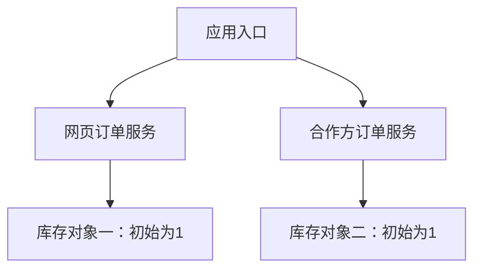
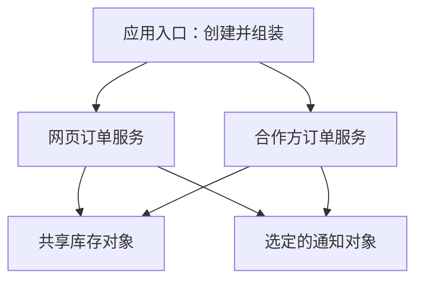

# 08-01-001 为什么需要 Spring 容器：机制与边界参考

首次学习请先完成 [逐步实作正文](README.md)。本页保留完整样例、概念比较、源码入口与边界分析，用于跟写后的查阅。

[模块入口](../README.md) · [本课在大纲中的位置](../00-模块学习大纲.md#lesson-001) · [阶段08](../../README.md)

我们从一个具体问题开始：两个订单入口都在卖同一种商品，实际只剩一件库存。为什么某种写法会让两个入口都下单成功？

这一课用普通 Java 把问题运行出来，再把对象组装移到应用入口。读完后，你应该能说明：业务对象需要哪些依赖、谁选择依赖的实现、哪些对象应该共享，以及 Spring 容器将承接什么工作。

本课只需要看懂类、接口、构造器、字段与方法调用。所有源码已放在本目录，运行命令可以直接使用。Spring 依赖将在第003课的容器工程中引入；这里先建立理解容器所需的对象模型。

<a id="section-1"></a>

## 1. 先把业务范围说清楚

系统有网页下单与合作方下单两个入口。它们应当操作同一份库存。每次下单按以下顺序执行：

1. 尝试扣减购买数量对应的库存。
2. 库存不足，返回失败，不发送通知。
3. 扣减成功，发送订单接受通知，返回成功。

示例只处理一种商品，以内存整数表示库存。两个入口顺序执行，不涉及并发请求、数据库和网络服务。所谓“邮件”和“短信”只是不同的控制台输出，运行时不会发送真实消息。

先认识几个对象：

| 对象 | 职责 | 是否需要共享 |
| --- | --- | --- |
| Order | 描述某一次下单的编号与数量 | 每次下单创建新的数据对象 |
| OrderService | 按业务顺序调用库存与通知能力 | 可以有多个服务实例，关键在于依赖如何组装 |
| Inventory | 声明预留库存的能力 | 两个入口应该使用同一份库存实现对象 |
| Notifier | 声明通知能力 | 由组装代码选择实现与实例 |

接口描述“需要什么能力”，实现类提供“具体怎么做”。但只声明接口，还不能决定一个对象最终拿到哪个实现、是不是同一个实例。后面就会看到这个差别。

<a id="section-2"></a>

## 2. 第一种写法：服务自己创建依赖

打开 [HardcodedOrderService.java](src/main/java/cn/ningbingjian/learnjava/ioc/lesson001/HardcodedOrderService.java)。主要代码如下：

```java
public final class HardcodedOrderService {
    private final Inventory inventory = new InMemoryInventory(1);
    private final Notifier notifier = new ConsoleEmailNotifier();

    public boolean place(Order order) {
        Objects.requireNonNull(order, "order");
        if (!inventory.reserve(order.getQuantity())) {
            return false;
        }
        notifier.orderAccepted(order);
        return true;
    }
}
```

这里的两个字段虽然声明为接口类型，但右侧仍写死了具体类：

- 创建一个服务时，就同时创建一份初始值为 1 的库存。
- 该服务固定使用控制台邮件通知。
- 调用者无法通过构造器传入另一份库存，也无法传入测试通知对象。

`place` 方法中的 `!` 表示取反。`reserve` 返回 `false` 时立即结束方法，因此不会执行后面的通知调用。`Objects.requireNonNull` 用于尽早拒绝空参数，与 Spring 没有关系。

这段业务流程本身很短。问题出在：**服务既执行下单流程，又决定依赖怎么创建。**

在 [DemoApplication.java](src/main/java/cn/ningbingjian/learnjava/ioc/lesson001/DemoApplication.java) 的 `runHardcoded` 方法中，我们创建两个服务：

```java
HardcodedOrderService webOrders = new HardcodedOrderService();
HardcodedOrderService partnerOrders = new HardcodedOrderService();

System.out.println("first=" + webOrders.place(new Order("O-001", 1)));
System.out.println("second=" + partnerOrders.place(new Order("O-002", 1)));
```

注意，这里是两个服务对象，不是同一个对象的两个变量名。每次执行 `new HardcodedOrderService()`，它的实例字段初始化代码都会为这个新服务创建依赖。



图中只画库存关系。两个服务还分别创建了通知对象。图里出现两份库存，是对象组装导致的业务建模错误；不是 Java 在复制一个共享对象。

<a id="section-3"></a>

## 3. 先把程序运行起来

安装 JDK 21 和 Maven 3.9.x 后，在仓库根目录运行：

```bash
java -version
mvn -version
```

两条命令都应显示使用 JDK 21。尤其注意 `mvn -version` 中的 Java 版本：IDE 能使用 JDK 21，并不保证终端的 Maven 也使用它。

进入本模块的 Maven 聚合工程并完成构建：

```bash
cd learn-java-course/phase08-spring/08-01-spring-core-ioc
mvn clean verify
```

本模块的父 `pom.xml` 统一管理编译与测试版本，本课是其中一个子模块。首轮构建需要下载 Maven 插件和 JUnit 依赖，之后可以复用本机缓存。

仍在这个目录，运行第一个场景：

```bash
java -cp 001-why-spring-container/target/classes cn.ningbingjian.learnjava.ioc.lesson001.DemoApplication hardcoded
```

预期输出：

```text
EMAIL order=O-001 quantity=1
first=true
EMAIL order=O-002 quantity=1
second=true
```

为什么邮件行出现在结果行前面？因为 Java 必须先执行 `place(...)`，取得返回值后，才能拼接并打印 `first=true`。通知是在 `place` 内部完成的。

两个入口都成功了。Java 执行完全符合代码：库存对象一从 1 减到 0，库存对象二也从 1 减到 0。程序没有“看见”我们业务上要求的同一份库存。

<a id="section-4"></a>

## 4. 问题究竟在哪里

如果让同一个 `HardcodedOrderService` 连续处理两单，第二单会失败，因为同一个服务会复用自己的库存字段。因此，不能简单归纳成“在类里面 new 就一定超卖”。

真正的问题是：**依赖的创建与共享方式被封在服务内部，调用者无法按照业务要求组织对象关系。**

本例把库存数据直接放在对象字段中，所以两个库存对象就有两份独立余额。如果两个数据库访问对象连接的是同一个数据库，数据是否共享还要看存储与事务设计，不能仅凭 Java 对象数量判断生产系统是否超卖。

把问题换成三个日常需求，就更容易理解：

| 新需求 | 当前写法遇到的困难 |
| --- | --- |
| 网页和合作方入口共享库存 | 两个服务内部各有一份库存，外部无法传入共享实例 |
| 某个环境使用短信通知 | 需要修改服务中的具体类选择 |
| 测试时只记录通知内容 | 无法直接传入记录器，往往要依靠更复杂的替换手段 |

给库存字段加 `static` 可以让这个教学例子中的服务共享一个进程内对象，但同时把资源归属固定到类级别。多个测试或多个独立应用实例想要不同库存时，又需要清理或替换全局状态。

我们希望共享关系能够由应用组织方式决定。它不应该被业务类内部的 `new` 或类级全局字段固定下来。

<a id="section-5"></a>

## 5. 第二种写法：把依赖交给构造器

打开 [OrderService.java](src/main/java/cn/ningbingjian/learnjava/ioc/lesson001/OrderService.java)：

```java
public final class OrderService {
    private final Inventory inventory;
    private final Notifier notifier;

    public OrderService(Inventory inventory, Notifier notifier) {
        this.inventory = Objects.requireNonNull(inventory, "inventory");
        this.notifier = Objects.requireNonNull(notifier, "notifier");
    }

    public boolean place(Order order) {
        Objects.requireNonNull(order, "order");
        if (!inventory.reserve(order.getQuantity())) {
            return false;
        }
        notifier.orderAccepted(order);
        return true;
    }
}
```

业务方法保持原来的流程。变化集中在构造器：

1. `Inventory inventory` 表示：创建服务时，调用者必须提供一个具有库存能力的对象。
2. `this.inventory = ...` 保存调用者传来的对象引用，不会在这里复制一个库存对象。
3. `Notifier` 同理，服务无需知道最终是邮件、短信还是测试记录器。
4. `final` 限制字段引用在初始化后被重新赋值；它不保证引用对象内部的数据不可变，也不保证线程安全。

这已经是一种依赖注入：对象通过构造器接收所需依赖。这个做法可以完全用 Java 实现。Spring 后续会按照配置帮助完成这样的装配。[Spring 官方对依赖注入的说明](https://docs.spring.io/spring-framework/reference/core/beans/introduction.html)

接口与构造器各解决一部分问题：接口允许多种实现满足同一能力要求；构造器让外部能够把选择好的实现对象交给服务。只有接口类型、但在内部写死 `new`，仍然没有开放这个组装入口。

<a id="section-6"></a>

## 6. 谁来创建对象？应用入口来组装

再看 `DemoApplication.runManual`：

```java
private static void runManual(Notifier notifier) {
    InMemoryInventory inventory = new InMemoryInventory(1);
    OrderService webOrders = new OrderService(inventory, notifier);
    OrderService partnerOrders = new OrderService(inventory, notifier);

    System.out.println("first=" + webOrders.place(new Order("O-001", 1)));
    System.out.println("second=" + partnerOrders.place(new Order("O-002", 1)));
    System.out.println("remaining=" + inventory.remainingStock());
}
```

这里仍然有 `new`，而且非常必要。变化是：创建依赖和建立引用关系的代码集中到了应用入口。

两个 `OrderService` 都接收变量 `inventory` 保存的同一个引用。因此，第一个服务扣减库存后，第二个服务访问的是已经变成 0 的那个对象。



运行手动组装版本：

```bash
java -cp 001-why-spring-container/target/classes cn.ningbingjian.learnjava.ioc.lesson001.DemoApplication manual
```

预期输出：

```text
EMAIL order=O-001 quantity=1
first=true
second=false
remaining=0
```

第二次调用没有产生邮件输出，因为 `reserve` 返回了 `false`，业务方法提前返回。

这一结果依赖正确的组装。如果把第二个构造器参数中的共享库存改成一个新的 `InMemoryInventory(1)`，即使仍然使用构造器注入，两个入口还是会分别拥有库存。**依赖注入提供了表达对象关系的方式，正确的对象关系仍然需要设计。**

<a id="section-7"></a>

## 7. 替换通知实现时，业务类需要改吗

`main` 方法根据运行参数选择通知对象：

```java
case "manual" -> runManual(new ConsoleEmailNotifier());
case "sms" -> runManual(new ConsoleSmsNotifier());
```

两个实现都遵守 `Notifier` 接口，都会接收被接受的订单；区别只是输出渠道标记。`->` 是 Java 的 switch 分支写法，此处表示这个模式要执行哪个方法。

运行短信版本：

```bash
java -cp 001-why-spring-container/target/classes cn.ningbingjian.learnjava.ioc.lesson001.DemoApplication sms
```

预期输出：

```text
SMS order=O-001 quantity=1
first=true
second=false
remaining=0
```

库存与下单结果保持一致，通知渠道改变。修改的是应用入口选用的实现，`OrderService.place` 不需要改动。

测试时也利用同一个入口。[OrderServiceTest.java](src/test/java/cn/ningbingjian/learnjava/ioc/lesson001/OrderServiceTest.java) 中有一个 `RecordingNotifier`，它把订单编号存进列表。业务服务仍然调用 `orderAccepted`，但测试可以直接检查记录，无需发送通知，也无需启动 Spring。

<a id="section-8"></a>

## 8. 手动组装已经能工作，Spring 容器还负责什么

对于本课的三个服务对象，集中在应用入口手动组装完全合理。接下来考虑对象增加后的变化：不同环境选择不同实现，某些对象需要共享，某些对象按次创建，还有对象需要初始化和关闭。

应用就需要持续管理这些问题：

| 需要作出的安排 | 手动组装时的位置 | 后续 Spring 学习中的对应内容 |
| --- | --- | --- |
| 哪些服务交给统一管理 | 入口中列出要创建的服务 | Bean 注册与 BeanDefinition |
| 每个服务依赖什么 | 构造器参数与调用顺序 | 依赖解析与装配 |
| 哪些地方共享同一个实例 | 重复传递同一引用 | 作用域与对象获取 |
| 不同环境选用哪个实现 | 入口分支与配置处理 | 配置、Profile 与条件注册 |
| 何时初始化、何时关闭资源 | 入口维护启动和关闭流程 | 生命周期回调与容器关闭 |

Spring IoC 容器会读取配置元数据，创建、配置并组装受它管理的对象。具体注册方式和生命周期行为将在后续课程实际运行验证。[Spring 容器概览](https://docs.spring.io/spring-framework/reference/core/beans/basics.html)

容器没有替你判断“哪两个业务入口应该共享一份库存”。它也不会自动让内存库存变成数据库事务，或让所有对象都线程安全。我们提供合理的配置与组件设计，再由容器执行对象管理工作。

本课没有提前手写一个 Map 加反射的“迷你 Spring”。到这里，你首先需要看清被管理的工作是什么，后续学习容器机制才有对应的问题。

<a id="section-9"></a>

## 9. 哪些对象适合交给容器，哪些仍然自己创建

本例中的订单服务、库存访问组件与通知组件，是相对稳定的协作对象，可以在后续 Spring 版本里作为 Bean 管理。

而 `new Order("O-001", 1)` 表达一次具体业务输入。它随每次调用变化，通常由请求处理、业务流程或持久化代码创建。一次排序中的临时列表、一次计算的中间结果，也无需仅因为使用了 Spring 就全部变成 Bean。

“有没有使用 new”不是判断设计好坏的标准。更有用的问题是：这个对象代表什么、生命周期由谁负责、谁需要持有它，以及这种关系是否容易正确地表达与验证。

<a id="section-10"></a>

## 10. 按这个顺序阅读和调试源码

| 顺序 | 文件 | 重点观察 |
| --- | --- | --- |
| 1 | [DemoApplication](src/main/java/cn/ningbingjian/learnjava/ioc/lesson001/DemoApplication.java) | 参数如何选择场景，实例在哪里创建 |
| 2 | [HardcodedOrderService](src/main/java/cn/ningbingjian/learnjava/ioc/lesson001/HardcodedOrderService.java) | 每次创建服务时，两个依赖字段如何初始化 |
| 3 | [OrderService](src/main/java/cn/ningbingjian/learnjava/ioc/lesson001/OrderService.java) | 构造器保存的引用来自哪里，业务流程有没有改变 |
| 4 | [InMemoryInventory](src/main/java/cn/ningbingjian/learnjava/ioc/lesson001/InMemoryInventory.java) | remaining 属于哪个实例，失败时是否修改库存 |
| 5 | [Notifier](src/main/java/cn/ningbingjian/learnjava/ioc/lesson001/Notifier.java) 与两个实现 | 相同方法调用怎样产生不同渠道输出 |
| 6 | [OrderServiceTest](src/test/java/cn/ningbingjian/learnjava/ioc/lesson001/OrderServiceTest.java) | 如何独立验证共享、隔离与失败时的行为 |

在 IDEA 中导入上一级 `pom.xml`，将项目 SDK 与 Maven 使用的 JDK 设为 21。打开 `DemoApplication.main`，使用运行配置的 Program arguments 切换 `hardcoded`、`manual`、`sms`。

建议先在 `InMemoryInventory` 构造器与 `reserve` 中打断点：

1. `hardcoded` 模式下，构造器会执行两次。查看两次 `reserve` 中的 `this`，它们指向不同库存对象。
2. `manual` 模式下，构造器只执行一次。第二次进入 `reserve` 时，`remaining` 已经为 0。
3. 在 `OrderService` 构造器查看传入的 `inventory`，它与应用入口保存的是同一个引用。

IDE 展示的对象标识可能不同，重点是比较引用是否指向同一对象，不需要记住某个显示编号，也不要把它当作稳定的内存地址。

<a id="section-11"></a>

## 11. 运行测试，核对自己的解释

在模块根目录执行：

```bash
mvn -pl 001-why-spring-container -am test
```

`-pl` 选择本课子模块，`-am` 同时构建它需要的同一聚合工程中的模块。本课测试使用 JUnit，父 POM 统一管理版本；测试运行机制将在研发工程与后续测试课程深入说明。

当前有 6 个测试：

| 测试 | 验证的行为 |
| --- | --- |
| acceptedOrderReducesStockAndNotifiesExactlyOnce | 成功后扣减库存，并且恰好记录一次通知 |
| insufficientStockDoesNotChangeStockOrNotify | 库存不足时不扣减、不通知 |
| servicesSharingInventoryCannotEachSpendTheSameUnit | 两个服务共享一件库存时只有第一单成功 |
| separateInventoryInstancesStillCreateSeparateBalances | 即使构造器注入，传入两个库存仍然得到两份余额 |
| notificationFailureDoesNotMagicallyRollBackTheReservation | 通知抛异常后，已经发生的库存扣减不会自行恢复 |
| independentApplicationGraphsDoNotLeakStateToEachOther | 两套独立组装的应用可以有各自的库存和通知记录 |

测试中的 `assertTrue`、`assertFalse` 和 `assertEquals` 表示期望成立的行为，`assertThrows` 表示预期抛出指定异常。第三个测试使用两个服务共同访问一个库存，是本课最关键的回归检查。

第五个测试提醒我们观察真实执行顺序：先扣库存，后发通知；通知失败时，本示例没有补偿或事务逻辑。对象组装的改进不会自动改变这个业务事实。可靠通知与一致性方案会在后续事务和消息课程处理。

<a id="section-12"></a>

## 12. 做三个小改动，验证是否真正理解

### 12.1 两件库存与第三个订单

把手动组装版本的初始库存改为 2，再增加第三个购买数量为 1 的订单。先预测成功次数、通知次数和剩余库存，再运行核对。

<details>
<summary>展开参考结果</summary>

前两单成功，第三单失败；共两次通知，剩余库存为 0。两个服务仍然访问同一个对象，增加服务实例不会增加业务库存。

</details>

### 12.2 故意组装错一次

让 `partnerOrders` 接收新创建的 `InMemoryInventory(1)`。解释为什么这个版本虽然使用了构造器注入，却仍会让两单都成功。

<details>
<summary>展开参考解释</summary>

注入传递的是调用者提供的引用。调用者传入了两个不同库存对象，就建立了两份独立状态。构造器不会自动把相同类型的对象合并。可以对照 `separateInventoryInstancesStillCreateSeparateBalances` 测试。

</details>

### 12.3 添加一个新的通知渠道

新增一个实现 `Notifier` 的控制台站内信通知类，并在应用入口选择它。检查自己是否改动了 `OrderService.place`。再思考：如果新的实现会抛异常，库存是否会自动回滚？

<details>
<summary>展开参考解释</summary>

实现接口并修改组装位置即可替换渠道，业务流程不需要修改。通知实现抛异常时，库存仍保持已经扣减的结果；接口替换与事务保证是不同的问题。

</details>

<a id="section-13"></a>

## 13. 常见运行问题与示例边界

| 现象 | 检查位置 |
| --- | --- |
| `mvn: command not found` | Maven 是否安装并加入终端 PATH |
| `release version 21 not supported` | 用 `mvn -version` 检查 Maven 实际使用的 JDK |
| `UnsupportedClassVersionError` | 运行 `java` 的版本是否与 JDK 21 编译目标匹配 |
| 找不到 DemoApplication | 是否先构建，是否位于模块根目录，`target/classes` 是否存在 |
| 插件或 JUnit 下载失败 | 查看具体下载地址与网络配置；不要把依赖解析失败误判为代码测试失败 |

运行范围是单进程、单线程、单商品的内存演示。`InMemoryInventory` 没有并发保护和持久化；订单没有存储和幂等校验；通知失败没有补偿。这些边界让本课能够集中观察对象身份、共享关系与组装职责。

接下来的 [08-01-002 IoC、DI 与对象装配](../002-ioc-di-object-assembly/README.md) 会用本课的对象关系进一步区分 IoC、DI、依赖倒置与服务定位。第003课再建立真正运行 Spring 容器的工程。
