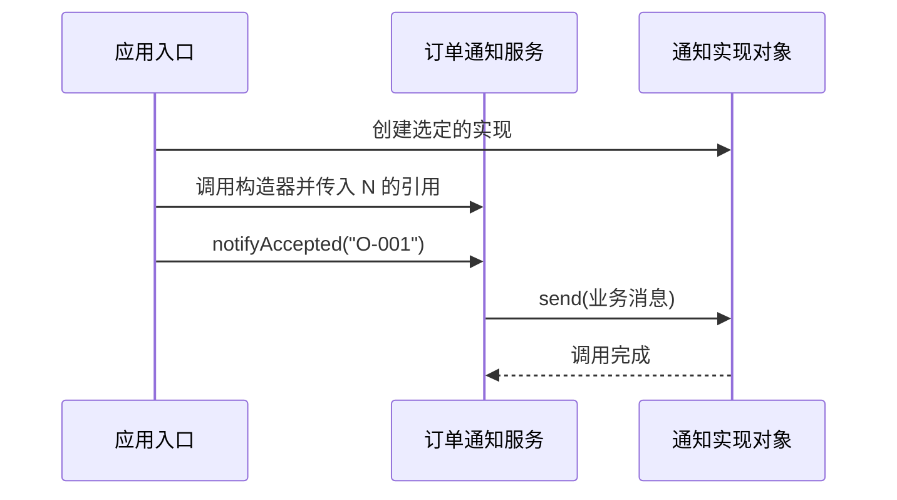

# 08-01-002 IoC、DI 与对象装配：机制与边界参考

首次学习请先完成 [逐步实作正文](README.md)。本页保留完整样例、概念比较、源码入口与边界分析，用于跟写后的查阅。

[上一课：为什么需要 Spring 容器](../001-why-spring-container/README.md) · [模块入口](../README.md) · [本课大纲](../00-模块学习大纲.md#lesson-002)

上一课把依赖对象的创建移到了应用入口。现在还需要回答：这为什么叫依赖注入？它和控制反转、依赖倒置有什么关系？业务代码自己向一个注册表取对象，又算什么？

本课继续使用订单通知场景。我们把注意力集中在“订单已经成功之后，如何选择并调用通知能力”，暂时去掉上一课的库存逻辑。业务类负责生成通知内容，邮件和短信实现负责输出。这些实现只打印控制台，不会发送真实消息。

你会运行七个场景，对照构造器、setter、字段写入、服务定位、具体类型依赖和回调驱动。源码使用普通 Java，Spring 容器仍在第003课引入。

<a id="section-1"></a>

## 1. 先把四个概念放到不同的问题上

| 概念 | 主要回答什么问题 | 在本课中看哪里 |
| --- | --- | --- |
| IoC：控制反转 | 某项控制权交给谁，比如组装对象或驱动业务回调 | 入口负责组装；分发器负责调用回调 |
| DI：依赖注入 | 对象需要的协作者如何交给它 | 构造器参数、setter、外部字段写入 |
| DIP：依赖倒置原则 | 业务规则与实现细节之间的源码依赖如何安排 | 应用层定义 Notifier，渠道实现依赖这个契约 |
| Service Locator：服务定位 | 消费者如何通过一个入口主动查找所需服务 | 业务方法调用 locator.getNotifier() |

这四个词不是四种互斥产品。一个程序里可以同时有回调、构造器注入和服务定位。判断时，要指出正在讨论的是哪一层关系、哪个对象，以及哪一项控制权。

例如，定位器本身可以通过构造器传给业务类；但业务类仍然可能在每次业务调用时主动向它查找真正的通知对象。此时“定位器被注入”和“通知能力被定位”同时成立。

<a id="section-2"></a>

## 2. 运行入口与代码分区

本课继承上一级 Maven 父工程，与第001课共同构建，独立使用 `lesson002` 包。示例没有依赖第001课的实现类，便于单独阅读和运行；编译与 JUnit 版本仍由父 POM 统一管理。

在仓库根目录执行：

```bash
cd learn-java-course/phase08-spring/08-01-spring-core-ioc
mvn clean verify
```

使用 JDK 21 和 Maven 3.9.x。执行 `mvn -version` 可以确认 Maven 实际使用的 Java 版本。后续命令都在上面的模块根目录执行。

| 代码位置 | 作用 |
| --- | --- |
| [application/Notifier.java](src/main/java/cn/ningbingjian/learnjava/ioc/lesson002/application/Notifier.java) | 应用层定义的通知契约 |
| [application/OrderNotificationService.java](src/main/java/cn/ningbingjian/learnjava/ioc/lesson002/application/OrderNotificationService.java) | 业务消息与构造器注入版本 |
| [adapter](src/main/java/cn/ningbingjian/learnjava/ioc/lesson002/adapter) | 邮件和短信的控制台实现 |
| [comparison](src/main/java/cn/ningbingjian/learnjava/ioc/lesson002/comparison) | setter、字段、定位器与具体类型依赖的对照版本 |
| [assembly](src/main/java/cn/ningbingjian/learnjava/ioc/lesson002/assembly) | 定位器和显式字段写入工具 |
| [runtime/OrderEventDispatcher.java](src/main/java/cn/ningbingjian/learnjava/ioc/lesson002/runtime/OrderEventDispatcher.java) | 最小事件回调驱动示例 |
| [DemoApplication.java](src/main/java/cn/ningbingjian/learnjava/ioc/lesson002/DemoApplication.java) | 选择实现、创建对象、安排调用 |

这几组包用于显式展示依赖方向，未拆成多个独立部署模块。若将来把应用层和渠道实现拆成不同 Maven 模块，仍需要用构建依赖和检查保护这个边界。

<a id="section-3"></a>

## 3. 构造器注入：创建时提供必需协作者

业务类的主要代码是：

```java
public final class OrderNotificationService {
    private final Notifier notifier;

    public OrderNotificationService(Notifier notifier) {
        this.notifier = Objects.requireNonNull(notifier, "notifier");
    }

    public void notifyAccepted(String orderId) {
        Objects.requireNonNull(orderId, "orderId");
        notifier.send("order=" + orderId + " accepted");
    }
}
```

构造器表达了明确的创建契约：需要一个通知协作者。调用者提供实际对象，服务保存它的引用，之后通过该引用调用 `send`。

这里没有接口实例的自动生成，也没有 Spring 隐藏在构造器后面。真正运行的是普通 Java 参数传递与字段赋值。`Objects.requireNonNull` 使传入 `null` 在构造时就被拒绝；仅仅把依赖写进构造器参数，并不会让 Java 自动禁止 `null`。

运行邮件版本：

```bash
java -cp 002-ioc-di-object-assembly/target/classes cn.ningbingjian.learnjava.ioc.lesson002.DemoApplication constructor-email
```

预期输出：

```text
EMAIL order=O-001 accepted
```

应用入口选择 `ConsoleEmailNotifier`，再把它传给 `OrderNotificationService`。要改成短信，只改变装配处的实现选择：

```bash
java -cp 002-ioc-di-object-assembly/target/classes cn.ningbingjian.learnjava.ioc.lesson002.DemoApplication constructor-sms
```

预期输出：

```text
SMS order=O-001 accepted
```

`OrderNotificationService` 仍然负责生成同样的业务消息，消息随后由选定的渠道输出。



前两步属于对象创建和装配，后面的步骤属于业务运行。程序运行时仍然由服务调用通知对象；注入没有把这条业务调用方向颠倒。

Spring 可以根据配置执行同样的构造器调用。它的依赖注入能力建立在对象声明依赖、外部负责提供依赖这一关系上。[Spring 官方依赖注入说明](https://docs.spring.io/spring-framework/reference/core/beans/dependencies/factory-collaborators.html)

<a id="section-4"></a>

## 4. setter 注入：对象存在与对象可用可以分开

对照 [SetterOrderNotificationService.java](src/main/java/cn/ningbingjian/learnjava/ioc/lesson002/comparison/SetterOrderNotificationService.java)：

```java
public void setNotifier(Notifier notifier) {
    this.notifier = Objects.requireNonNull(notifier, "notifier");
}
```

调用者先创建服务，再调用 setter 设置依赖。服务的实例已经存在，但在 setter 执行前，字段仍是 `null`。本课为这种情况加了明确的状态检查：

```java
if (notifier == null) {
    throw new IllegalStateException("notifier must be set before use");
}
```

这条异常来自我们编写的业务类，不是 Spring 的启动错误。程序故意先调用未配置的对象，捕获并打印异常，再补齐配置以便观察后续行为。

```bash
java -cp 002-ioc-di-object-assembly/target/classes cn.ningbingjian.learnjava.ioc.lesson002.DemoApplication setter
```

预期输出：

```text
before-config=notifier must be set before use
EMAIL order=O-001 accepted
SMS order=O-002 accepted
```

过程如下：

1. `new SetterOrderNotificationService()` 创建一个尚未配置通知能力的对象。
2. 第一次调用被状态检查拒绝。
3. 设置邮件对象后，通知 O-001。
4. 再设置短信对象后，通知 O-002。

这个 setter 允许重新赋值，因此第二次设置影响后续调用。它没有撤销已经发送的第一条通知，也没有改变旧通知对象本身。

“setter 适合可选依赖”是设计取向，不是语法限制：本例用 setter 设置的就是必需依赖，所以必须处理未完成配置的状态。真正可选的依赖应有清楚的缺省行为。至于运行时更换依赖是否安全，还要设计并发、资源交接与生命周期；普通 setter 不会自动提供这些保证。

<a id="section-5"></a>

## 5. 字段注入：需要外部执行一次字段写入

[FieldOrderNotificationService.java](src/main/java/cn/ningbingjian/learnjava/ioc/lesson002/comparison/FieldOrderNotificationService.java) 只有一个私有通知字段，没有接收它的构造器，也没有 setter。

为了让字段赋值这一动作可观察，本课提供了专用的 [ManualFieldInjector.java](src/main/java/cn/ningbingjian/learnjava/ioc/lesson002/assembly/ManualFieldInjector.java)。它固定操作本课的目标类和字段：

```java
Field field = FieldOrderNotificationService.class.getDeclaredField("notifier");
field.setAccessible(true);
field.set(target, notifier);
```

三行分别是：找到名为 `notifier` 的字段；在当前允许的访问环境中开启反射访问；把通知对象引用写入目标实例。这里没有注解扫描、依赖解析或生命周期管理，也没有实现 Spring 的字段注入处理器。

运行：

```bash
java -cp 002-ioc-di-object-assembly/target/classes cn.ningbingjian.learnjava.ioc.lesson002.DemoApplication field
```

预期输出：

```text
before-injection=notifier has not been injected
EMAIL order=O-001 accepted
```

只执行 `new FieldOrderNotificationService()` 时，Java 不会主动调用我们的注入工具。第一次业务调用失败；应用入口显式写入字段后，第二次调用才成功。

以后看到 Spring 的 `@Autowired` 字段，也应继续追问：谁发现这个注解、谁选择候选对象、什么时候写入字段？给自己创建的普通对象写上注解，并不等于有容器替它完成了这些工作。真正的处理路径将在注解应用与源码篇展开。

本例运行在普通 classpath 中，操作的是本课程自己的类。反射访问仍受 Java 访问规则和模块边界限制；这里的成功不代表任何私有字段都能任意写入。

### 三种注入方式如何比较

| 比较点 | 构造器 | setter | 字段 |
| --- | --- | --- | --- |
| 依赖从哪里进入 | 创建对象时的参数 | 创建后的方法调用 | 创建后的外部字段写入 |
| 本课缺失依赖何时暴露 | 构造器中的非空检查 | 第一次业务调用的状态检查 | 第一次业务调用的状态检查 |
| 创建后能否替换引用 | 本例 final 字段没有替换入口 | 本例允许再次调用 setter | 本例工具可以再次写入字段 |
| 普通 Java 测试如何装配 | 直接调用构造器 | 创建后调用 setter | 需要显式字段写入工具 |
| 从创建 API 能看到什么 | 直接看到所需通知能力 | 还需要知道配置步骤 | 无参创建无法说明字段装配要求 |

这张表描述本课实现。框架可能在启动时检测缺失依赖，因此不能推导出“所有 setter 或字段注入都要等业务调用才失败”。无论选哪一种，都要区分实例化完成和组件已满足使用条件。

对于这里必需且固定的通知协作者，构造器让创建契约更容易表达和测试。`final` 只限制引用的重新赋值，不保证通知对象不可变、可用或线程安全。

<a id="section-6"></a>

## 6. DI 与 DIP：对象传递方式和源码依赖方向

再看一个故意保留具体类型的对照：[ConcreteDependencyService.java](src/main/java/cn/ningbingjian/learnjava/ioc/lesson002/comparison/ConcreteDependencyService.java)。

```java
private final ConsoleEmailNotifier notifier;

public ConcreteDependencyService(ConsoleEmailNotifier notifier) {
    this.notifier = Objects.requireNonNull(notifier, "notifier");
}
```

它确实通过构造器接收外部对象，所以有构造器注入。但是字段与参数类型直接写成邮件实现。要把 `ConsoleSmsNotifier` 传进去，Java 类型检查就不会通过。

运行这个合法的邮件版本：

```bash
java -cp 002-ioc-di-object-assembly/target/classes cn.ningbingjian.learnjava.ioc.lesson002.DemoApplication concrete
```

预期输出：

```text
EMAIL order=O-001 accepted
```

它与前面的构造器邮件版本输出相同，却有不同的源码依赖。**运行结果相同，不能证明它们具有相同的可替换性。**

在需要独立演进的业务与通知渠道边界上，依赖倒置关注的是：业务规则面向自己需要的通知契约，渠道实现来满足这个契约。业务源码无需导入具体邮件或短信类。这里区分的是源码依赖与运行期调用，后者仍然会执行实际通知对象的方法。[Robert C. Martin 对这一区别的说明](https://blog.cleancoder.com/uncle-bob/2016/01/04/ALittleArchitecture.html)

本课通过包结构让这个关系可见：

| 位置 | 依赖哪些类型 | 由谁决定变化 |
| --- | --- | --- |
| application.OrderNotificationService | application.Notifier | 业务需要怎样的通知能力 |
| adapter.ConsoleEmailNotifier | application.Notifier | 邮件渠道如何实现契约 |
| adapter.ConsoleSmsNotifier | application.Notifier | 短信渠道如何实现契约 |
| DemoApplication | 业务服务和选定的渠道实现 | 这次应用使用哪个实现 |

应用入口需要知道具体实现，才能创建并连接对象；这个责任可以集中在装配边界。不能因为入口仍然出现具体类名，就认为整个设计没有使用依赖倒置。

也不需要给所有类机械地增加接口。先找到需要隔离或替换的边界，再设计稳定且贴合业务的契约。如果接口本身泄漏了某个邮件厂商专用类型，即便业务字段类型是接口，耦合也可能仍然存在。

<a id="section-7"></a>

## 7. 服务定位：业务对象主动获取依赖

[LocatorOrderNotificationService.java](src/main/java/cn/ningbingjian/learnjava/ioc/lesson002/comparison/LocatorOrderNotificationService.java) 的业务方法是：

```java
public void notifyAccepted(String orderId) {
    Objects.requireNonNull(orderId, "orderId");
    locator.getNotifier().send("order=" + orderId + " accepted");
}
```

前面的构造器版本已经持有通知对象；这里则在每次调用时向 `NotificationLocator` 取对象。定位器内部维护一项通知注册，找不到时抛出明确异常。

```bash
java -cp 002-ioc-di-object-assembly/target/classes cn.ningbingjian.learnjava.ioc.lesson002.DemoApplication locator
```

预期输出：

```text
before-register=notifier is not registered
EMAIL order=O-001 accepted
SMS order=O-002 accepted
```

定位器对象和业务服务都能成功创建，但定位器还没有注册通知实现，所以第一次查找失败。注册邮件后第一次正常通知；改注册短信后，下一次查找取得新的对象。

这个例子没有使用静态全局注册表。两个 `NotificationLocator` 实例可以保有各自的注册信息。因此，不能把服务定位直接定义成“静态工具类取 Bean”。模式的关键在于消费者主动查找所需服务，而不是是否存在 `static`。

### 定位器已经通过构造器传入，为什么还说这里有服务定位

要分别看两条依赖：

- 对 `NotificationLocator` 而言，业务类通过构造器接收它。
- 对 `Notifier` 而言，业务类通过业务方法中的查找取得它。

构造器保证了定位器引用不为 null，却没有证明注册表中存在通知能力。这就是为什么对象可以构造成功，但通知调用仍然失败。

如果业务类改为接收一个通用容器，调用者只看构造器往往难以了解它实际使用了哪些能力。这里用的是单一能力、强类型的定位器，依赖相对明确；这种写法仍让服务承担了查找时机和查找失败的处理问题。[Fowler 对依赖注入与服务定位的讨论](https://martinfowler.com/articles/injection.html)

### 重新注册，是否会修改已经注入的对象

测试 `rebindingLocatorChangesLookupButNotAnAlreadyInjectedReference` 同时创建两个服务：一个每次查找，另一个在创建时接收当时取到的通知对象。

| 操作 | 每次定位的服务 | 已通过构造器注入的服务 |
| --- | --- | --- |
| 先注册通知对象 A | 查找得到 A | 构造器保存 A 的引用 |
| 将定位器注册改成 B | 下次查找得到 B | 仍持有 A 的引用 |

修改注册表不会自动遍历已有对象并替换它们的字段。若注入的是代理、Provider 或其他间接访问对象，则行为还取决于那层对象的实现；后续再学习这些机制。本课的直接引用行为可以通过测试明确观察。

同样，在应用入口调用一次定位器，再把取到的通知对象传给业务类，业务类这一侧仍然是直接接收依赖。必须观察查找发生在哪个对象、哪个执行阶段。

<a id="section-8"></a>

## 8. IoC 更广：除了对象组装，还有执行流程的控制权

前几节讨论对象组装：服务声明自己需要的协作者，应用入口负责选择和提供。从服务自己创建依赖，转为由外部决定并提供依赖，是这里体现控制反转的一种方式。

另一种常见情形是回调：你提供一段业务处理逻辑，由框架或驱动程序决定何时调用它。本课用 [OrderEventDispatcher.java](src/main/java/cn/ningbingjian/learnjava/ioc/lesson002/runtime/OrderEventDispatcher.java) 展示最小的驱动边界：

```java
for (String orderId : orderIds) {
    System.out.println("DISPATCH " + orderId);
    handler.accept(orderId);
}
```

应用入口先装配业务服务，再把方法作为回调交给分发器：

```java
dispatcher.dispatch(List.of("O-001", "O-002"), service::notifyAccepted);
```

`service::notifyAccepted` 是 Java 方法引用。它把这个服务的处理方法交给 `Consumer<String>` 接口；当分发器执行 `handler.accept(orderId)` 时，就调用该服务的 `notifyAccepted(orderId)`。

```bash
java -cp 002-ioc-di-object-assembly/target/classes cn.ningbingjian.learnjava.ioc.lesson002.DemoApplication callback
```

预期输出：

```text
DISPATCH O-001
EMAIL order=O-001 accepted
DISPATCH O-002
EMAIL order=O-002 accepted
```

分发器掌握订单遍历和回调调用顺序，业务服务只处理传给它的订单编号。它们的职责不同：分发器不需要知道邮件如何发送，也不创建或注入通知对象。

这里有两件独立的安排：入口先完成依赖注入，之后分发器控制回调执行。实际 Web 容器、事件框架和测试框架也会有类似的驱动边界，但本例只是一个同步循环，没有实现事件队列、持久化、异步调度或 Spring 事件系统。

因此，不能仅凭“出现接口”“使用反射”或“加了注解”判断是否发生控制反转。要能指出原本由谁负责的具体控制权，现在由谁负责。

<a id="section-9"></a>

## 9. Bean、普通 Java 对象与 JavaBean

到现在为止，本课创建的都是普通 Java 对象。它们虽然采用构造器注入，也不会因此自动成为 Spring 管理的对象。

Spring 语境中的 Bean 是由 IoC 容器管理的对象。对象的 Java 类不需要因为这个身份而变成特殊语法；关键在于它如何进入容器的管理范围。[Spring 官方对 Bean 的定义](https://docs.spring.io/spring-framework/reference/core/beans/introduction.html)

| 表达 | 应该怎样理解 |
| --- | --- |
| 一个普通 Java 类 | 描述对象的类型，与是否采用 Spring 无关 |
| 一个手动创建的服务实例 | Java 对象；本课没有将它注册到 Spring |
| Spring 管理的服务实例 | 在相应容器中具有 Bean 身份及相应管理行为 |
| JavaBean 命名与属性约定 | 与 Spring Bean 是不同语境，不能用是否有 setter 来判断容器管理身份 |

`new` 与容器管理也不是非此即彼：后续 Java 配置中的工厂方法仍可以执行 `new`，返回对象由容器接入管理。相反，单独在一个类上写注解，却没有让它经过相应的注册与处理流程，也不能期待某个实例自动完成注入。

本课三个容易混淆的结论，可以这样区分：

1. 普通 Java 类能够使用依赖注入。
2. 依赖注入不要求一定通过接口传参，接收具体类型也可以属于注入。
3. 是否依赖适当的抽象、是否由 Spring 管理，分别是另外的问题。

<a id="section-10"></a>

## 10. 阅读源码和打断点的路线

先运行构造器两个渠道的场景，再按 setter、field、locator、concrete、callback 的顺序阅读。每次只改变一个要观察的关系。

| 断点 | 观察内容 |
| --- | --- |
| OrderNotificationService 构造器 | 参数实际类型、保存的引用、缺失依赖何时失败 |
| SetterOrderNotificationService.setNotifier | 对象存在后，字段从 null 到通知对象，再切换到另一个对象 |
| ManualFieldInjector.inject | Field 描述的成员与实际被写入的目标实例 |
| NotificationLocator.getNotifier | 每次业务调用都会查找，返回对象随注册变化 |
| OrderEventDispatcher 的 handler.accept | 查看调用栈，谁在驱动业务方法执行 |

比较源码依赖时，查看 `application` 与 `comparison` 中类的字段类型和 import。运行时看到某个实际对象是邮件实现，不等于业务源码必须依赖邮件实现类；这两种观察需要分开。

通过 IDEA 导入上一级 `pom.xml` 后，可以运行本课 `DemoApplication.main`，在 Program arguments 中填入对应场景名。默认模式是 `constructor-email`。

<a id="section-11"></a>

## 11. 测试如何证明这些差别

在模块根目录只执行本课测试：

```bash
mvn -pl 002-ioc-di-object-assembly -am test
```

[DependencyAssemblyTest.java](src/test/java/cn/ningbingjian/learnjava/ioc/lesson002/DependencyAssemblyTest.java) 提供 9 个测试，使用记录消息的 `RecordingNotifier` 验证调用对象和调用时机，不依赖网络或 Spring 上下文。

| 测试 | 核对的行为 |
| --- | --- |
| constructorRejectsMissingMandatoryDependencyImmediately | 构造时拒绝缺失的必需依赖 |
| constructorUsesTheProvidedCollaboratorWithoutAContainer | 业务类调用传入的记录器，消息内容正确 |
| setterObjectExistsBeforeItIsReadyAndWorksAfterConfiguration | 创建成功不等于完成配置；配置后可以工作 |
| setterReplacementAffectsSubsequentCallsOnly | 重配影响后续通知，不会重写先前记录 |
| fieldDependencyNeedsAnExternalWriterBeforeUse | 外部字段写入发生前后行为不同 |
| injectedLocatorDoesNotGuaranteeThatTheActualServiceIsRegistered | 定位器存在不保证真正的依赖已注册 |
| rebindingLocatorChangesLookupButNotAnAlreadyInjectedReference | 重新注册影响查找结果，已有直接引用保持不变 |
| separateLocatorInstancesDoNotShareRegistrations | 本例定位器实例没有全局共享注册状态 |
| dispatcherCallsBusinessCallbackInEventOrder | 分发器按输入顺序调用业务，消息内容与顺序正确 |

第001课的 6 个测试也保留在聚合工程中。执行 `mvn clean verify` 会一起运行两课的 15 个测试。

<a id="section-12"></a>

## 12. 用三个改动检查理解

### 12.1 改成可选通知

假设某个业务流程允许不发通知。请说明你准备使用什么缺省行为，然后决定是否仍把通知依赖设为必需。

<details>
<summary>展开参考思路</summary>

一种方式是提供明确的 NoOpNotifier，在装配处选择它，并继续保持构造器必需依赖。另一种是把“没有通知能力”作为可选状态，在业务规则中明确处理。两种设计都需要保证它符合业务含义，不能把依赖遗漏默认为“不发通知”。本课代码尚未添加这两种变体，作为练习完成。

</details>

### 12.2 改变查找时机

把 `LocatorOrderNotificationService` 改为只在构造器中调用一次 `getNotifier()`，之后保存结果。再次注册通知对象后，业务调用还会变化吗？

<details>
<summary>展开参考解释</summary>

如果保存的是普通通知对象的直接引用，后续注册变化不会影响该引用。缺失通知的错误也会由业务调用时提前到服务构造时。这是查找时机与引用保存方式的变化；构造器中仍然存在主动查找，不能仅因为错误提前就称为直接注入了通知能力。

</details>

### 12.3 检查接口是否真的隔离实现

假如把 Notifier 的参数改为邮件厂商 SDK 的请求对象，业务类虽然依赖接口，是否还与邮件实现独立？

<details>
<summary>展开参考解释</summary>

业务代码仍需要理解并引用厂商类型，接口把具体技术细节带进了业务边界。可让应用层使用自己定义的数据或能力契约，在渠道适配器内部完成转换。重点在于隔离需要独立变化的边界，不在于接口数量。

</details>

<a id="section-13"></a>

## 13. 本课结论与下一步

现在你应能指着代码说明：谁创建对象，谁传入依赖，谁主动查找依赖，谁控制业务方法的调用，以及业务源码是否知道具体渠道实现。

这些示例使用单线程、已知订单编号和控制台通知。setter 重配、定位器注册及字段写入没有并发协调；这里用它们观察时序和引用行为，不把它们当成生产动态配置方案。

下一课是 [08-01-003 建立可运行、可调试的学习工程](../003-runnable-debuggable-spring/README.md)。届时引入 Spring Framework 依赖，用实际容器创建和获取对象，再把本课的手动装配关系与容器行为对应起来。
