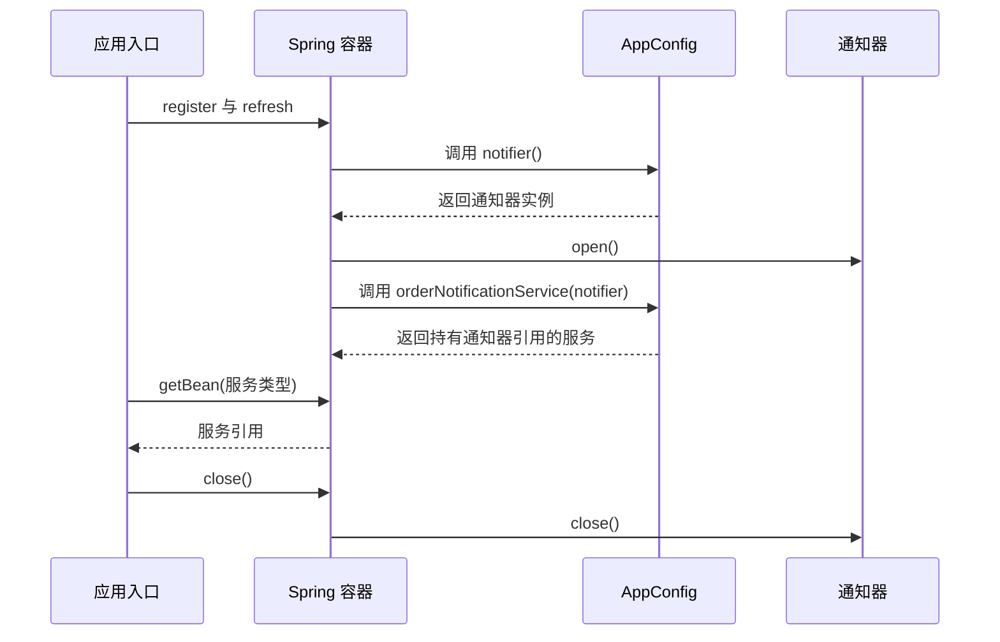

# 08-01-003 建立可运行、可调试的学习工程：机制与边界参考

首次学习请先完成 [逐步实作正文](README.md)。本页保留完整样例、概念比较、源码入口与边界分析，用于跟写后的查阅。

[返回模块目录](../README.md) · [本课在大纲中的位置](../00-模块学习大纲.md#lesson-003) · [上一课：IoC、DI 与对象装配](../002-ioc-di-object-assembly/README.md)

前两课中，入口代码自己创建通知渠道，再把它传给订单通知服务。这一课保留同样的业务关系，把装配入口交给真正的 Spring 容器。

完成本课后，你应能独立导入工程、确认实际使用的 JDK 和依赖版本、运行一个非 Web 的 Spring 应用，并用断点回答：配置什么时候被处理，业务对象什么时候产生，依赖是谁传进来的，容器关闭后发生了什么。

<a id="section-1"></a>

## 1. 先明确本课的工程边界

本课使用 JDK 21、Maven 3.9.x、Spring Framework **7.0.9**、JUnit Jupiter **5.13.4**。这些是课程固定基线，不表示读者应追随每次新版本修改工程。命令行构建验证使用 Maven 3.9.11；二进制依赖、源码包和源码标签都对齐到 7.0.9。

应用只有一个 `main` 入口，没有 HTTP 端口、Servlet 容器和数据库。运行完成后进程退出是预期行为。Spring Framework 提供容器能力；本课没有引入 Spring Boot，也没有使用自动配置。

先在终端检查：

```bash
java -version
mvn -version
```

两处 Java 版本都应为 21。`mvn -version` 还会显示 Maven 实际使用的 Java home；终端的 `java`、Maven 的 Java 和 IDE 的运行 JDK 可能分别指向不同位置。父 POM 的 `maven.compiler.release=21` 约束编译目标与可用的 Java API，不负责下载安装 JDK。

第一次构建需要从配置的 Maven 仓库下载依赖和插件。遇到网络或仓库认证问题，先检查 Maven 的报错和本机仓库配置；业务代码还没有执行时，不应通过修改 Spring 配置来解决下载失败。

<a id="section-2"></a>

## 2. 理解工程结构，再导入 IDE

将 [IoC 模块父 POM](../pom.xml) 作为 Maven 工程导入 IDE。它使用 `pom` 打包方式，组织三门课，并集中管理公共版本；本课的 [子 POM](pom.xml) 使用默认的 `jar` 打包方式，产出本课的类与普通 JAR。

| 位置 | 职责 |
| --- | --- |
| `../pom.xml` | 聚合子模块，管理 Java 编译目标、依赖版本、插件版本 |
| `pom.xml` | 声明本课使用 `spring-context` 和 JUnit，配置本课的运行入口 |
| `src/main/java/.../lesson003` | 可运行的业务类、配置类与应用入口 |
| `src/test/java/.../lesson003` | 容器启动、引用关系和关闭行为的自动化验证 |
| `target/classes` | Maven 编译产生的业务字节码 |
| `target/test-classes` | Maven 编译产生的测试字节码 |
| `target/surefire-reports` | 测试报告；由构建产生，不提交到 GitHub |

本课使用独立的 `lesson003` 包，不依赖第001、002课的 JAR。复制少量业务模型，是为了让每课都能独立运行、修改和比较。

IDE 中把 Project SDK、Maven 导入/运行 JDK 和本课运行配置的 JRE 统一为 21。重新加载 Maven 工程后，检查 `src/main/java` 与 `src/test/java` 是否被识别为对应的源码目录。不要只打开一个 Java 文件，然后手工把多个 JAR 拼进 IDE 的库列表。

<a id="section-3"></a>

## 3. 为什么只声明 spring-context 就能使用容器

父 POM 导入 `spring-framework-bom:7.0.9`，子 POM 声明：

```xml
<dependency>
    <groupId>org.springframework</groupId>
    <artifactId>spring-context</artifactId>
</dependency>
```

BOM 是一组依赖版本约束。`dependencyManagement` 管理版本和依赖默认信息，不会自动把所有受管理的库放到应用类路径中。第001、002课仍然没有 Spring 运行依赖；本课显式声明 `spring-context` 后，Maven 才根据其 POM 解析所需的传递依赖。

在 IoC 模块目录执行：

```bash
mvn -pl 003-runnable-debuggable-spring dependency:tree
```

重点检查下面的角色，而不是把四个名字背成容器启动的四个步骤：

| 构件 | 本模块中的职责 | 本课可以定位的类型 |
| --- | --- | --- |
| `spring-core` | 资源访问、类型与反射等基础能力 | `org.springframework.core.io.Resource` |
| `spring-beans` | Bean 定义、BeanFactory 与对象创建、依赖装配的基础设施 | `DefaultListableBeanFactory` |
| `spring-context` | 应用上下文、注解配置入口及启动关闭过程的组织 | `AnnotationConfigApplicationContext`、`AbstractApplicationContext` |
| `spring-expression` | Spring 表达式语言的解析与求值 | `SpelExpressionParser` |

在 **7.0.9 的发布 POM** 中，`spring-context` 直接依赖 `spring-aop`、`spring-beans`、`spring-core`、`spring-expression` 和 Micrometer Observation。`spring-beans`、`spring-expression` 又依赖 `spring-core`。因此依赖树会有共享依赖，Maven 的普通输出可能省略重复路径。

看到 `spring-aop` 被下载，不代表本课业务对象已经被 AOP 代理；看到 Micrometer 依赖，也不代表应用已经向监控平台发送数据。依赖在类路径中与某项功能实际启用是不同事实。这里的依赖关系可与 [7.0.9 的 spring-context POM](https://repo.maven.apache.org/maven2/org/springframework/spring-context/7.0.9/spring-context-7.0.9.pom) 对照。

父 POM 还固定了编译、测试等插件版本。本课增加 Exec Maven Plugin 3.5.0 与 Maven Dependency Plugin 3.8.1：前者按 Maven 解析的类路径运行入口，后者查看依赖和下载源码。JUnit 是 `test` 范围依赖，不需要出现在应用的正常运行类路径中。

<a id="section-4"></a>

## 4. 用五个类接通第一次容器运行

本课源码都在 [lesson003 包](src/main/java/cn/ningbingjian/learnjava/ioc/lesson003)。阅读顺序如下：

| 文件 | 需要先理解的内容 |
| --- | --- |
| [Notifier.java](src/main/java/cn/ningbingjian/learnjava/ioc/lesson003/Notifier.java) | 业务依赖的通知能力 |
| [OrderNotificationService.java](src/main/java/cn/ningbingjian/learnjava/ioc/lesson003/OrderNotificationService.java) | 构造器接收依赖，业务方法委托通知渠道 |
| [ManagedConsoleNotifier.java](src/main/java/cn/ningbingjian/learnjava/ioc/lesson003/ManagedConsoleNotifier.java) | 打印消息，并通过 `open` 标记观察初始化和关闭 |
| [AppConfig.java](src/main/java/cn/ningbingjian/learnjava/ioc/lesson003/AppConfig.java) | 告诉 Spring 如何创建这两个业务对象 |
| [DemoApplication.java](src/main/java/cn/ningbingjian/learnjava/ioc/lesson003/DemoApplication.java) | 启动容器、取出业务入口、调用业务、关闭容器 |

`OrderNotificationService` 没有 Spring 注解，也没有保存 `ApplicationContext`。它依然可以通过 `new OrderNotificationService(notifier)` 单独使用。容器管理发生在装配边界，业务类没有因此失去普通 Java 类的性质。

`ManagedConsoleNotifier` 的 `open()` 把布尔值设为 `true`，`close()` 设为 `false`，`send()` 在未打开时抛出异常。它没有真实网络连接；这个状态用于直观看见资源生命周期。真实客户端还需要考虑初始化失败、连接释放和并发使用等问题，本课不把布尔标记当作生产资源管理方案。

配置类完整代码如下：

```java
@Configuration(proxyBeanMethods = false)
public class AppConfig {
    @Bean(initMethod = "open", destroyMethod = "close")
    public ManagedConsoleNotifier notifier() {
        return new ManagedConsoleNotifier();
    }

    @Bean
    public OrderNotificationService orderNotificationService(Notifier notifier) {
        return new OrderNotificationService(notifier);
    }
}
```

先抓住这些代码在本例中的含义：

1. `@Configuration` 标记用于描述对象装配的配置类。我们会把 `AppConfig.class` 显式交给容器，不依赖组件扫描。
2. `@Bean` 方法提供受管理对象的创建方式。未另行指定名字时，本例两个 Bean 分别名为 `notifier` 和 `orderNotificationService`。
3. 第二个方法需要一个 `Notifier` 参数。Spring 为这个参数解析候选对象，本例只有 `ManagedConsoleNotifier` 符合，然后把它传进方法。方法内部继续用 Java 构造器完成业务对象创建。
4. `initMethod = "open"` 与 `destroyMethod = "close"` 明确指定初始化和销毁回调。因此本例能看到 `notifier.open` 与 `notifier.close`。
5. `proxyBeanMethods = false` 表示不通过增强配置类拦截这些方法之间的调用。本例用方法参数表达依赖，没有调用 `notifier()` 来获取另一个 Bean；不要自行改成普通 Java 方法调用后，仍假定它一定返回容器中的那个对象。

这些说明足够支撑本课运行。Java 配置的声明方式、跨方法调用和配置类行为会在下一课及后续源码课程详细展开。

<a id="section-5"></a>

## 5. 第一次构建与运行

以下所有 `mvn` 命令都在 **`08-01-spring-core-ioc` 目录**执行。先构建父工程和全部课程：

```bash
mvn clean verify
```

构建成功后运行本课：

```bash
mvn -q -pl 003-runnable-debuggable-spring exec:java -Dexec.args=lifecycle
```

`-pl` 选择子模块，`exec:java` 使用子模块配置的 `mainClass` 和项目依赖来运行程序。这个目标在 Maven JVM 中执行，不额外启动独立 Java 进程；`-q` 隐藏常规 Maven 日志，不隐藏应用输出。Exec 的行为见 [官方参数文档](https://www.mojohaus.org/exec-maven-plugin/java-mojo.html)。

本例的业务输出为：

```text
before-refresh.active=false
after-register.has-notifier-definition=false
notifier.open
after-refresh.active=true
after-refresh.has-notifier-definition=true
before-get.has-notifier-singleton=true
same-service=true
EMAIL order=O-001 accepted
notifier.close
after-close.active=false
after-close.notifier-open=false
after-close.get=IllegalStateException
```

首次只构建本课，可以用：

```bash
mvn -pl 003-runnable-debuggable-spring -am test
```

`-am` 会连同所选模块需要的 reactor 项目一起构建。运行 `exec:java` 时只选择本课，不加 `-am`，以免在没有本课入口的父项目上也执行运行目标。修改代码后先重新编译：

```bash
mvn -q -pl 003-runnable-debuggable-spring compile exec:java -Dexec.args=lifecycle
```

不要沿用前两课仅含 `target/classes` 的 Java 类路径命令：本课还需要 Spring 及其传递依赖。`package` 生成的是普通 JAR，没有配置可执行 JAR 的 `Main-Class`，也没有把依赖打进去；直接 `java -jar` 不属于本工程提供的运行方式。

<a id="section-6"></a>

## 6. 把输出对应到容器状态和对象状态

入口先执行 `context.register(AppConfig.class)`，打印注册后的观察结果，再执行 `context.refresh()`。随后从容器取出 `OrderNotificationService`，调用业务方法，最后离开 `try (context)` 作用域。

这里至少存在三种不同事物：容器对象、描述如何创建 Bean 的定义、真正参与业务调用的 Bean 实例。不要因为变量里已经有 `context`，就认为后两者都准备好了。

| 观察位置 | 本例发生的事实 | 不能据此推导的结论 |
| --- | --- | --- |
| 无参构造后 | 上下文已存在，`isActive()` 为 `false` | 业务 Bean 都已创建 |
| `register(AppConfig.class)` 后 | 注册了配置类；此时没有名为 `notifier` 的 Bean 定义 | `register` 会立刻执行全部 `@Bean` 方法 |
| `refresh()` 返回后 | 配置已经被处理，两个业务 Bean 的定义存在；默认非懒加载单例已创建，通知器已初始化 | 所有类型、所有作用域的 Bean 都只能在 `refresh` 中创建 |
| 两次业务 `getBean` 后 | 返回同一个默认单例服务引用 | 所有容器、所有 Bean 名称、所有作用域共享一个对象 |
| `close()` 后 | 上下文不再 active，受管理通知器执行了关闭 | JVM 已删除仍被外部引用的 Java 对象 |

第一行 `after-register.has-notifier-definition=false` 检查的是 `@Bean` 方法对应的定义，**不是说容器没有任何定义**。`AnnotationConfigApplicationContext` 自身会准备基础设施，注册配置类也有自己的定义；配置类的方法在后续处理时才形成这里的业务 Bean 定义。

`before-get.has-notifier-singleton=true` 在业务入口首次调用 `getBean` 之前执行。它与初始化输出一起说明，本例的通知器在 `refresh()` 期间已经创建。因而不能把 `getBean` 简化为“每次都执行 `new`”；它可能返回已经存在的对象，也可能在其他配置下触发创建。

`same-service` 使用 Java 的 `==` 比较引用身份，不比较内容。测试还会启动两个上下文，验证它们各自拥有不同的服务与通知器实例。本例“同一个”限定在同一容器中同一默认单例定义的重复获取。

<a id="section-7"></a>

## 7. 观察真正的依赖传递

在配置类中看到 `new` 是正常的。Spring 接管的是何时使用创建规则、如何找到依赖以及如何管理产物；最终对象仍然要通过 Java 的实例化机制产生。



图中只保留本例装配与关闭关系，省略框架内部处理器。业务调用仍由 `main` 发起：取出服务后调用 `notifyAccepted("O-001")`，服务再通过已经保存的 `notifier` 引用发送消息。

与第002课对照：构造器注入的业务关系没有变化，变化的是装配代码由 Spring 在启动过程中组织执行。`getBean` 放在应用入口；`OrderNotificationService` 没有为每次业务调用查询容器，仍然使用显式传入的协作者。

<a id="section-8"></a>

## 8. 两种容器构造方式与一个启动错误

### 8.1 无参构造：适合观察启动前后

`new AnnotationConfigApplicationContext()` 之后，需要注册配置并显式 `refresh()`。本课的 `lifecycle` 模式拆开这些步骤，以便放断点。

### 8.2 带配置类构造：返回时已完成启动

```bash
mvn -q -pl 003-runnable-debuggable-spring exec:java -Dexec.args=shortcut
```

```text
notifier.open
shortcut.active=true
EMAIL order=O-001 accepted
notifier.close
```

对应代码是：

```java
try (AnnotationConfigApplicationContext context =
             new AnnotationConfigApplicationContext(AppConfig.class)) {
    System.out.println("shortcut.active=" + context.isActive());
    context.getBean(OrderNotificationService.class).notifyAccepted("O-001");
}
```

带配置类的构造器内部依次调用无参构造、`register(componentClasses)` 和 `refresh()`，因此 `notifier.open` 出现在 `shortcut.active` 前。使用这种构造方式后，不要再补一次 `refresh()`；本例上下文不支持反复刷新。两种入口可对照 [官方容器创建说明](https://docs.spring.io/spring-framework/reference/core/beans/java/instantiating-container.html) 与 [7.0.9 构造器源码](https://github.com/spring-projects/spring-framework/blob/v7.0.9/spring-context/src/main/java/org/springframework/context/annotation/AnnotationConfigApplicationContext.java)。

### 8.3 漏掉 refresh：存在容器引用也不能取业务对象

```bash
mvn -q -pl 003-runnable-debuggable-spring exec:java -Dexec.args=not-refreshed
```

```text
before-refresh.get=IllegalStateException
```

该模式注册配置后直接调用 `getBean`，程序捕获预期异常并打印类型，便于比较。真实排错时保留完整异常栈；`IllegalStateException` 是通用异常类型，仅凭类名无法确定是否漏掉启动。本例可以沿 `AbstractApplicationContext.getBean` 进入活动状态检查，看到尚未刷新这一条分支。

<a id="section-9"></a>

## 9. 为什么要明确关闭容器

容器可以管理超出普通内存对象的资源，例如连接池和线程池。对象不再被业务使用，与资源已经按协议释放并不是同一件事。

本例通过 `try-with-resources` 明确调用上下文的 `close()`，随后 Spring 调用配置指定的通知器销毁方法。不要再在业务入口额外调用 `notifier.close()`，否则资源所有权会变得不清楚。初始化/销毁方法的配置语义见 [官方 @Bean 生命周期说明](https://docs.spring.io/spring-framework/reference/core/beans/java/bean-annotation.html)。

再运行一个业务抛异常的场景：

```bash
mvn -q -pl 003-runnable-debuggable-spring exec:java -Dexec.args=business-failure
```

```text
notifier.open
EMAIL order=O-001 accepted
notifier.close
caught=simulated business failure
```

`try` 体内主动抛出异常，Java 在进入外层 `catch` 之前关闭上下文，所以先看到 `notifier.close`。这个演示捕获异常是为了打印结果，不是在建议生产代码吞掉所有 `IllegalStateException`。

还有两个边界必须分开：

- 容器关闭后，再通过该上下文 `getBean` 会失败。
- 已经取出的服务引用仍是普通 Java 引用。调用它不会自动跳回容器检查状态；本例是通知器自己的 `send()` 检查到已关闭而失败。没有这种检查的其他对象，行为可能不同。

因此，`close()` 不等于强制把所有对象回收。垃圾回收仍取决于可达性；销毁回调也不应与 JVM 的内存回收机制混为一谈。

<a id="section-10"></a>

## 10. 下载与运行依赖完全一致的源码

从 IoC 模块目录执行：

```bash
mvn -pl 003-runnable-debuggable-spring dependency:sources -DincludeGroupIds=org.springframework
```

该目标为已解析的依赖获取 sources 包，不会重新编译 Spring。插件行为见 [Maven Dependency Plugin 官方说明](https://maven.apache.org/plugins/maven-dependency-plugin/sources-mojo.html)。在默认 Maven 本地仓库中，`spring-context` 的二进制与源码应对应：

```text
org/springframework/spring-context/7.0.9/spring-context-7.0.9.jar
org/springframework/spring-context/7.0.9/spring-context-7.0.9-sources.jar
```

本地仓库通常位于用户目录的 `.m2/repository`，也可能由 Maven settings 改到其他位置；以当前 Maven 配置为准。IDE 的 Maven 依赖节点应显示 `spring-context:7.0.9`，打开类型时使用同版本源码附件。如果仍显示反编译代码，可重新加载 Maven、下载源码，或给该依赖手工附加已下载的 sources JAR。

浏览网页时同样使用 `v7.0.9` 标签，不拿 GitHub `main` 上的某一行作为当前运行依据。源码附件只影响阅读；**运行时执行的是二进制 JAR 中的字节码**。修改附件里显示的源码，不会自动修改依赖字节码。

这一课直接调试 Maven 工程依赖即可。完整克隆和构建 Spring 自身的 Gradle 工程属于后续源码开发准备，和给应用附加源码是两项工作。

<a id="section-11"></a>

## 11. 第一轮断点：验证自己的对象与引用

在 IDE 新建或直接运行 Java Application：

| 配置项 | 值 |
| --- | --- |
| 主类 | `cn.ningbingjian.learnjava.ioc.lesson003.DemoApplication` |
| 模块类路径 | `lesson-003-runnable-debuggable-spring` 对应的 Maven 子模块 |
| 程序参数 | `lifecycle` |
| JRE | JDK 21 |

源码目录中有多课 `DemoApplication`，应按完整包名确认本课入口。使用 **Debug** 启动，先只放以下断点：

| 断点位置 | 停下时观察什么 | 继续执行后应看到什么 |
| --- | --- | --- |
| `DemoApplication` 的 `context.register(...)` 行 | `context` 已存在，尚未 active | 注册配置类；还没有本例的 `notifier` 定义 |
| `AppConfig.notifier()` 的 `return new ...` 行 | 调用栈来自 Spring 启动处理；构造器还没执行 | 产生本次容器管理的通知器实例 |
| `ManagedConsoleNotifier.open()` 的赋值行 | `this.open` 初始为 `false` | 单步后变成 `true` |
| `AppConfig.orderNotificationService(...)` 的返回行 | 参数 `notifier` 已经指向通知器对象 | 构造服务并保存这个引用 |
| `DemoApplication` 的 `service.notifyAccepted(...)` 行 | `service == again` 为 `true`；展开 `service.notifier` 与局部变量 `notifier` 比较对象身份 | 通知调用发生在已经初始化的通知器上 |
| `ManagedConsoleNotifier.close()` 的赋值行 | 调用来自上下文关闭过程；`open` 此时为 `true` | 单步后变成 `false` |

断点通常停在执行该行之前，因此在赋值语句上暂停时要单步一次再观察新值。对象编号、内存显示格式和标识字符串会随 IDE 与运行变化，不需要和截图中的数字一致；需要验证的是两个引用是否指向同一对象。

观察表达式尽量使用本课的局部变量和简单状态。尤其不要在 `refresh()` 还没结束时反复求值 `getBean()`：它有可能触发创建并改变正在观察的时序。测试中的 `containsSingleton` 用于检查已存在对象；后面的源码课会解释缓存结构。

<a id="section-12"></a>

## 12. 第二轮断点：进入 Spring 源码，但只追当前问题

业务断点能命中后，再打开 7.0.9 源码设置断点。不同 IDE 的“跳过库代码”选项可能让单步跳过 Spring；直接在依赖源码中放断点，或调整调试步进过滤配置。

| 问题 | 源码定位 | 需要验证的具体内容 |
| --- | --- | --- |
| 带参数构造器为什么已经启动？ | `AnnotationConfigApplicationContext(Class<?>... componentClasses)` | 看到它调用 `register` 后调用 `refresh`；使用 `shortcut` 模式验证 |
| 无参构造后为什么不能取 Bean？ | `AbstractApplicationContext.getBean(Class<T>)` → `assertBeanFactoryActive()` | 使用 `not-refreshed` 模式，观察尚未 active 的检查分支 |
| 业务对象为何早于入口中的 `getBean` 创建？ | `AbstractApplicationContext.refresh()` → `finishBeanFactoryInitialization(...)` | 从本例配置工厂方法断点往回看调用栈，确认创建发生于这次 `refresh` 内 |
| 为什么两次取到同一个实例？ | `AbstractApplicationContext.getBean(Class<T>)` → BeanFactory | 在业务入口比较两个结果；本课先确认复用事实，缓存命中和创建分支在后续源码系列展开 |
| 谁调用通知器的 `close()`？ | `AbstractApplicationContext.doClose()` → `destroyBeans()`；`DisposableBeanAdapter.destroy()` | 从通知器关闭断点检查调用栈；本例同时实现 `AutoCloseable`，销毁适配器有对应的关闭分支 |

源码入口：[AnnotationConfigApplicationContext](https://github.com/spring-projects/spring-framework/blob/v7.0.9/spring-context/src/main/java/org/springframework/context/annotation/AnnotationConfigApplicationContext.java)、[AbstractApplicationContext](https://github.com/spring-projects/spring-framework/blob/v7.0.9/spring-context/src/main/java/org/springframework/context/support/AbstractApplicationContext.java)、[DisposableBeanAdapter](https://github.com/spring-projects/spring-framework/blob/v7.0.9/spring-beans/src/main/java/org/springframework/beans/factory/support/DisposableBeanAdapter.java)。

这时无需单步跟完整个 `refresh()`。建议先从自己工厂方法与生命周期回调的断点反向查看调用栈，找到框架与自己代码的交接位置。等后续学习 BeanDefinition、后处理器、创建流程和单例缓存时，再逐段展开那些中间调用。

调试记录不要只写“进入了某个类”。至少写清本次参数、对象是否已存在、调用发生在启动还是业务阶段，以及继续执行后的状态变化。例如：

> 在 `AppConfig.orderNotificationService` 暂停时，参数 `notifier` 已经打开；执行构造器后，服务字段保存同一引用。返回 `main` 后重复取服务得到同一个实例；退出作用域时，通知器关闭断点命中。

这是基于可观察事实的记录方式，后续源码课会沿用这种方法继续深入。

<a id="section-13"></a>

## 13. 常见故障，先判断发生在哪一层

| 现象 | 先检查 | 与本课相关的原因 |
| --- | --- | --- |
| `release version 21 not supported` | `mvn -version` 中的 Java | Maven 实际使用较旧 JDK |
| `UnsupportedClassVersionError` | 当前启动程序的 JRE | 运行 JDK 与编译出的字节码版本不兼容 |
| Maven 无法解析构件、超时或认证失败 | 仓库地址、网络、Maven settings | 依赖尚未下载，程序还没进入容器逻辑 |
| 找不到 Spring 类，或 `NoClassDefFoundError` | IDE 模块类路径、是否只用了 `target/classes` | 运行类路径缺少依赖 |
| `getBean` 报上下文尚未刷新 | 无参构造后是否调用 `refresh` | 注册配置与启动容器是分开的动作 |
| `NoSuchBeanDefinitionException` | 是否注册了 `AppConfig`、查找类型是否来自 `lesson003` | 启动成功不代表所需业务定义一定存在 |
| `NoUniqueBeanDefinitionException` | 同一类型是否新增了多个候选者 | 本课按类型解析的前提被修改；候选选择后续专门学习 |
| 断点空心或提示源码不匹配 | 实际依赖版本、源码附件、模块、是否重新编译 | 当前看到的源码与正在执行的类不一致 |
| 只看到 `notifier.open`，没看到关闭 | 是否到达关闭路径、是否用调试器强行结束进程 | 正常 Java 清理路径没有完成 |

遇到错误先保留完整异常栈，再定位最靠近根因的信息。不要看到业务类名就改业务，也不要为了让断点命中随意更换依赖版本。

<a id="section-14"></a>

## 14. 用测试固定这一次观察到的行为

[ContainerBootstrapTest.java](src/test/java/cn/ningbingjian/learnjava/ioc/lesson003/ContainerBootstrapTest.java) 包含八个测试：

1. 仅注册配置尚不能通过上下文获取业务对象。
2. `refresh` 创建并初始化本例的非懒加载单例，业务调用可以成功。
3. 同一容器中按类型、按名称重复获取返回同一个默认单例。
4. 两个容器分别拥有不同的对象图。
5. 容器关闭会释放本例资源，后续上下文查找失败。
6. 已持有的服务引用仍存在，但调用时会触及已关闭的通知器。
7. 业务抛异常时，`try-with-resources` 仍关闭上下文和资源。
8. 同一个业务服务可以用普通 Java 注入测试替身，在没有 Spring 容器时工作。

测试验证引用、状态和异常行为，不依赖随机对象编号，也不把整段框架日志作为判定条件。第001—003课聚合构建共 23 个测试。

完成运行后，可以自己做三个小改动；它们是练习要求，仓库没有预先替你实现：

1. 在 `lifecycle` 模式中多取一次 `Notifier`，用引用比较解释它与服务字段的关系；然后创建第二个上下文做对照。
2. 把 `initMethod` 暂时删除，预测 `send()` 会在哪一步失败。先解释原因，再运行；最后恢复配置。
3. 在服务首次业务调用前抛出异常，检查通知器是否已经初始化、是否仍会关闭，并用一个测试描述观察结果。

做第二题时，`destroyMethod` 仍然存在；“没有初始化成功进入业务可用状态”和“关闭流程是否触发”需要分别观察，不能合成一个“Bean 正常/不正常”的结论。

<a id="section-15"></a>

## 15. 下一课从这个工程继续

本课建立了可以重复构建、运行、测试和进入依赖源码的工程，也把前两课的手动装配关系接到了实际 Spring 容器上。

下一课：[08-01-004 使用 Java 配置显式组装对象](../004-java-config-object-assembly/README.md)。接下来会专门展开配置类、`@Bean` 与显式装配，把本课为了跑通入口而使用的配置写法讲完整。
