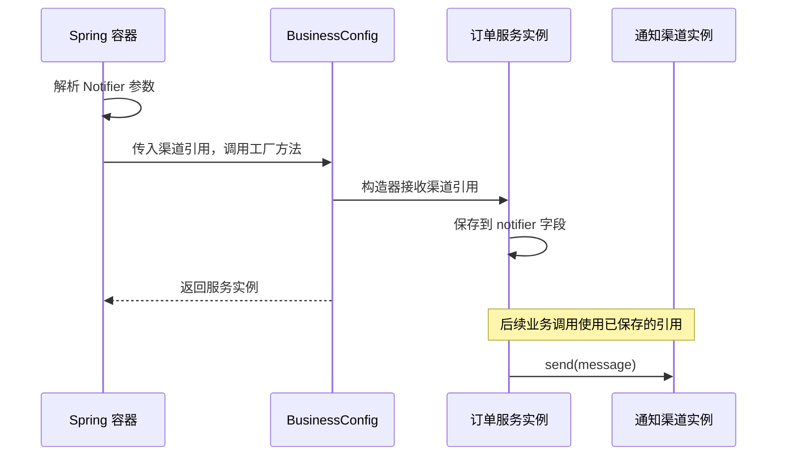

# 08-01-004 使用 Java 配置显式组装对象：机制与边界参考

首次学习请先完成 [逐步实作正文](README.md)。本页保留完整样例、概念比较、源码入口与边界分析，用于跟写后的查阅。

[返回模块目录](../README.md) · [本课在大纲中的位置](../00-模块学习大纲.md#lesson-004) · [上一课：建立可运行、可调试的学习工程](../003-runnable-debuggable-spring/README.md)

第003课已经跑通了容器。这一课把注意力放到配置本身：如何让一组普通 Java 对象按你声明的依赖关系组成应用，如何验证拿到的是期望的那个对象。

本课有两个业务入口：订单受理后发通知，回执准备好后发通知。它们共用一个通知渠道。我们先用邮件渠道组装，再换成短信渠道，随后用两个对照实验拆开 Bean 的名称、类型和对象身份。

学完后，你应能自己写出这一组配置，并解释每个 `@Bean` 方法返回什么、参数从哪里来、哪些对象会共享、修改通知实现会影响哪些文件。

<a id="section-1"></a>

## 1. 从需要协作的对象开始

业务关系中有两个服务和一个通知能力：

- `OrderNotificationService` 负责组织订单受理通知。
- `ReceiptNotificationService` 负责组织回执就绪通知。
- `Notifier` 提供 `send(String message)`；具体渠道决定如何发送。

订单服务的代码如下，省略包名与 import，完整文件见 [OrderNotificationService.java](src/main/java/cn/ningbingjian/learnjava/ioc/lesson004/OrderNotificationService.java)：

```java
public final class OrderNotificationService {
    private final Notifier notifier;

    public OrderNotificationService(Notifier notifier) {
        this.notifier = Objects.requireNonNull(notifier, "notifier");
    }

    public void notifyAccepted(String orderId) {
        notifier.send("order=" + Objects.requireNonNull(orderId, "orderId") + " accepted");
    }
}
```

回执服务采用同样的构造器依赖，发送的内容是 `receipt=R-001 ready`。业务类没有调用 `getBean`，没有决定邮件还是短信，也没有注入容器自身。

两个渠道实现都只打印控制台消息，不连接外部服务。它们各有一个实例字段 `sentCount`，每调用一次 `send` 就加一，用来观察消息到底落到哪个实例上。计数器采用普通 `int`，只用于本课单线程演示，不能当作并发安全的生产监控计数。

本课所有源码位于 [lesson004 包](src/main/java/cn/ningbingjian/learnjava/ioc/lesson004)。这是聚合工程的新子模块，不依赖前面课程的 JAR；依赖与插件版本继续继承父 POM 的 JDK 21、Spring Framework 7.0.9 和 JUnit 5.13.4 基线。

<a id="section-2"></a>

## 2. 配置先分清“业务组装”和“渠道选择”

[BusinessConfig.java](src/main/java/cn/ningbingjian/learnjava/ioc/lesson004/BusinessConfig.java) 只表达业务服务需要什么：

```java
@Configuration(proxyBeanMethods = false)
public class BusinessConfig {
    @Bean
    public OrderNotificationService orderNotificationService(Notifier deliveryChannel) {
        return new OrderNotificationService(deliveryChannel);
    }

    @Bean
    public ReceiptNotificationService receiptNotificationService(Notifier deliveryChannel) {
        return new ReceiptNotificationService(deliveryChannel);
    }
}
```

[EmailChannelConfig.java](src/main/java/cn/ningbingjian/learnjava/ioc/lesson004/EmailChannelConfig.java) 负责提供邮件渠道：

```java
@Configuration(proxyBeanMethods = false)
public class EmailChannelConfig {
    @Bean(name = {"orderNotifier", "notificationChannel"})
    public Notifier emailNotifier() {
        return new ConsoleEmailNotifier();
    }
}
```

这两个配置类需要导入 `org.springframework.context.annotation.Configuration` 与 `org.springframework.context.annotation.Bean`。

可以把它们放在一个配置类里，本例分开是为了让渠道变化时，业务组装代码保持稳定。分成两个文件不意味着有两个容器：我们稍后会把两个配置类交给**同一个上下文**。

本课显式使用 `proxyBeanMethods = false`，所有跨 Bean 依赖都通过方法参数表达。先按照这个约定理解配置；配置方法互相调用的差异在后续课程单独解释，当前不要把 `deliveryChannel` 改成对另一个 `@Bean` 方法的直接调用。

<a id="section-3"></a>

## 3. 逐步读懂 @Configuration 与 @Bean

先看 `@Configuration`。它表明这个类用于提供配置元数据，但注解不会自行启动程序。必须有一个入口把配置交给容器，或者由后续会学习的扫描、导入机制发现它。仅仅把类文件放在类路径中，不会使本课上下文自动纳入它。

再看 `@Bean`。这里的方法描述创建一个受管理对象的方式：方法返回的通知器或服务成为该定义对应的 Bean。配置类实例是提供工厂方法的对象，通知器实例是该方法产生的业务对象，二者不是同一件东西。

例如 `emailNotifier()` 的方法体仍然执行普通 Java 的 `new ConsoleEmailNotifier()`。Spring 负责组织调用、处理产物与管理生命周期；并没有要求你的业务对象继承某个 Spring 基类。这样的方式也适合组装不能修改源码、不能给它加组件注解的第三方类。

本例没有自定义 Bean 命名策略，两个不带 `name` 的业务方法分别使用方法名作为 Bean 名称：`orderNotificationService`、`receiptNotificationService`。渠道方法显式设置了名称，使用 `orderNotifier`，并附带别名 `notificationChannel`。具体命名规则与方法参数形式可对照 [Spring 官方 @Bean 文档](https://docs.spring.io/spring-framework/reference/core/beans/java/bean-annotation.html)。

注意 `@Bean` 不是“把一个 Java 类全局改造成单例”的标记。它对应这次容器注册的对象定义。同一个 Java 类可以由不同定义创建多个实例；本课第10节会直接运行验证。

<a id="section-4"></a>

## 4. 方法参数从哪里来：看清两次传递

在下面这个方法中，`deliveryChannel` 是普通 Java 方法参数：

```java
@Bean
public OrderNotificationService orderNotificationService(Notifier deliveryChannel) {
    return new OrderNotificationService(deliveryChannel);
}
```

实际装配有两次传递：

1. Spring 准备调用这个工厂方法，发现它需要一个 `Notifier`。当前配置中只有一个符合条件的渠道对象，Spring 解析该依赖，把对象引用作为 `deliveryChannel` 传入方法。
2. 方法内部执行 `new OrderNotificationService(deliveryChannel)`，把刚才的同一引用传给业务构造器。构造器把引用保存在服务字段里。

**Spring 解析工厂方法参数，配置方法再用构造器组装业务对象。**不要把这个例子描述成“Spring 对服务字段做了反射注入”：这里字段赋值发生在你自己写的 Java 构造器里。

为什么参数名叫 `deliveryChannel`，Bean 名却叫 `orderNotifier`？因为本例按类型只有一个合适候选者，名称不同并不阻止解析。参数名不是所有注入场景下都无关紧要；存在多个候选者时还涉及额外选择规则，本课不把“唯一候选者”的结果推广为全部规则。

同理，本例不需要给这个工厂方法参数再加 `@Autowired`。容器处理 `@Bean` 方法时会解析它所需的依赖。业务类也没有因为采用这种装配方式而需要新增注解。



图中略去了另一个回执服务。它采用同样的装配过程，最终两个不同服务的 `notifier` 字段指向同一个渠道对象。

<a id="section-5"></a>

## 5. 读取两个配置，完成一次业务调用

[DemoApplication.java](src/main/java/cn/ningbingjian/learnjava/ioc/lesson004/DemoApplication.java) 根据参数选择渠道配置，邮件模式传入 `EmailChannelConfig.class`。入口中的核心代码是：

```java
try (var context = new AnnotationConfigApplicationContext(BusinessConfig.class, channelConfig)) {
    var orderService = context.getBean(OrderNotificationService.class);
    var receiptService = context.getBean(ReceiptNotificationService.class);
    orderService.notifyAccepted("O-001");
    receiptService.notifyReady("R-001");
    System.out.println("notifier-count=" + context.getBeansOfType(Notifier.class).size());
    Notifier channel = context.getBean(Notifier.class);
    int count = channel instanceof ConsoleEmailNotifier email
            ? email.sentCount() : ((ConsoleSmsNotifier) channel).sentCount();
    System.out.println("channel.sent-count=" + count);
}
```

`Class<?> channelConfig` 保存的是本次选择的配置类，不是已经创建好的通知器实例。带配置类参数的上下文构造器会注册配置并执行刷新；返回之后，入口才开始获取服务、调用业务。

代码中的 `instanceof` 和向下转型只用于演示入口读取各渠道的观察计数。两个业务服务仍然只依赖 `Notifier`。本例入口明确只有邮件和短信两种选择，不要把这个诊断分支复制成生产系统不断增长的渠道分发逻辑。

构造器参数把 `BusinessConfig` 放在渠道配置前面，也可以正确完成依赖装配。这里没有同名覆盖、条件配置或复杂扩展；Spring 先处理所注册的定义，再依据依赖创建对象，不要求你通过这两个参数的先后来手工排列创建顺序。测试验证了反过来传这两个配置也能运行。

这个结论只覆盖当前配置。不要进一步推导成“Spring 中任何配置顺序永远不影响结果”。不同机制会有各自的排序与选择规则。

<a id="section-6"></a>

## 6. 构建并运行邮件、短信两个场景

以下命令都在 `08-01-spring-core-ioc` 目录执行。环境导入方式沿用第003课，先构建：

```bash
mvn clean verify
```

运行邮件模式：

```bash
mvn -q -pl 004-java-config-object-assembly exec:java -Dexec.args=email
```

```text
EMAIL order=O-001 accepted
EMAIL receipt=R-001 ready
notifier-count=1
channel.sent-count=2
```

第一、二行分别来自两个业务服务。`notifier-count=1` 是当前容器按 `Notifier` 类型查询到的 Bean 数量；`channel.sent-count=2` 是那个通知器实例自己的计数。两个观察组合起来，帮助你确认业务调用落到了容器管理的那个渠道上。

完整证明还可以在调试器中直接比较两个服务的字段引用，第12节给出了观察方法。单独看到两行 `EMAIL`，并不足以证明共用了实例——两个独立邮件对象也能输出相同前缀。

切换短信模式：

```bash
mvn -q -pl 004-java-config-object-assembly exec:java -Dexec.args=sms
```

```text
SMS order=O-001 accepted
SMS receipt=R-001 ready
notifier-count=1
channel.sent-count=2
```

短信配置 [SmsChannelConfig.java](src/main/java/cn/ningbingjian/learnjava/ioc/lesson004/SmsChannelConfig.java) 的工厂方法为：

```java
@Bean(name = {"orderNotifier", "notificationChannel"})
public Notifier smsNotifier() {
    return new ConsoleSmsNotifier();
}
```

这次启动选择另一份渠道配置，业务配置和两个业务服务没有改变。两个配置维持相同能力契约及 Bean 名称，但分别在不同运行中创建不同实现。

这里是**启动时选择配置**。已经运行的邮件上下文不会因为磁盘上有一个短信配置类就自动切换渠道；已经注入的 Java 引用也不会被这个例子动态替换。

每次运行只选择邮件或短信配置之一。不要把两份使用同名 Bean 的配置同时注册，再依赖覆盖顺序来“选择”实现。Profile、条件装配及覆盖规则属于后续专门内容。

如果只想构建当前课，可以执行：

```bash
mvn -pl 004-java-config-object-assembly -am test
```

修改代码后重新编译并运行：

```bash
mvn -q -pl 004-java-config-object-assembly compile exec:java -Dexec.args=email
```

运行目标只选本课，不加 `-am`；构建和测试时可以加。产物仍是普通 JAR，运行通过 Maven 配置的类路径完成。

<a id="section-7"></a>

## 7. 五个容易混在一起的概念

以下都以邮件配置为例：

| 概念 | 本例的值 | 这个值回答什么问题 |
| --- | --- | --- |
| 配置工厂方法名 | `emailNotifier` | 配置类中的哪个 Java 方法提供对象？ |
| Bean 主名称 | `orderNotifier` | 该 Bean 在容器里使用哪个主要标识？ |
| Bean 别名 | `notificationChannel` | 还可以用哪个名称访问同一个 Bean？ |
| 方法声明返回类型 | `Notifier` | 方法签名向调用方及容器提供了什么类型信息？ |
| 本例对象的运行时类型 | `ConsoleEmailNotifier` | 实際返回的这个对象属于哪个 Java 类？ |

对象身份还要单独判断：两个变量是否引用**同一个实例**。名称相同的讨论、类相同的讨论，都不能代替引用身份比较。Java 的 `==` 用来比较这里的引用，`equals` 则可能被类重写来比较业务内容。

运行身份观察模式：

```bash
mvn -q -pl 004-java-config-object-assembly exec:java -Dexec.args=identity
```

```text
factory-method=emailNotifier
bean-name=orderNotifier
aliases=[notificationChannel]
declared-type=Notifier
runtime-type=ConsoleEmailNotifier
same-name-and-type=true
same-name-and-alias=true
method-name-is-bean-name=false
notifier-count=1
```

`declared-type` 通过 Java 反射读取 `EmailChannelConfig.emailNotifier()` 的方法签名；`runtime-type` 来自返回对象的 `getClass()`，两者观察的对象不同。

`same-name-and-type` 比较按名称和按接口类型获取的引用；`same-name-and-alias` 比较主名称与别名获取的引用。两个结果都为 `true`，且按接口查到的 Bean 数量仍是一个。

`method-name-is-bean-name=false` 尤其需要注意：我们显式指定了名字，Spring 不会在本例中再自动保留 `emailNotifier` 作为额外别名。Java 方法名、默认命名规则和显式 Bean 名称是三个可以分开的层次。

<a id="section-8"></a>

## 8. 声明接口类型，不等于运行时对象变成接口

`emailNotifier()` 的返回类型为 `Notifier`，方法内部创建的仍是 `ConsoleEmailNotifier`。接口类型限制了静态调用方可依赖的能力，不会把对象转换成另一种“接口实例”。所以业务服务通过接口发送消息，调试器仍然可以看到对象的具体实现类。

Spring 在对象尚未创建时，需要根据配置元数据做类型判断。工厂方法签名是重要信息来源；只声明接口时，不能假定框架在所有创建阶段都已经知道其内部最终返回的具体实现类。

本例始终通过 `Notifier` 声明装配依赖，因此与接口返回类型一致。若以后确实有注入点依赖具体实现或该对象实现的另一个接口，应重新考虑返回类型是否提供了足够信息，不要依赖“恰好在另一个 Bean 之后创建，所以已经能识别”的偶然时序。相关限制见 [官方返回类型说明](https://docs.spring.io/spring-framework/reference/core/beans/java/bean-annotation.html)。

本课没有启用业务 AOP 代理，观察到的运行时类就是上述实现类。后续进入代理场景时，`getClass()` 可能返回代理类，那时还需要区分代理与目标对象；当前不根据本例输出推断所有 Spring Bean 的运行时类型。

<a id="section-9"></a>

## 9. 三种 getBean 调用，各自提供了什么条件

| 调用 | 本例中的选择条件 | 返回引用的静态类型 |
| --- | --- | --- |
| `getBean(Notifier.class)` | 根据类型寻找合适候选者；当前只有一个 | `Notifier` |
| `getBean("orderNotifier")` | 按名称或别名获取 | `Object` |
| `getBean("orderNotifier", Notifier.class)` | 按名称获取，并校验要求的类型 | `Notifier` |

第三种写法不是“把任意 Bean 强制变成这个类型”。测试故意请求 `getBean("orderNotifier", ConsoleSmsNotifier.class)`：名称可以定位到邮件对象，但该对象不是短信实现，容器抛出 `BeanNotOfRequiredTypeException`。

本课主入口按服务类型获取业务对象；名称和别名查询主要用于验证配置。业务服务内部继续使用构造器传入的依赖，不为了发送每条消息主动查找容器。

`getBeansOfType(Notifier.class)` 返回以 Bean 名为键的集合，可用于查看候选者。本例查询发生在上下文启动完成后；不要把这类查询随意放进初始化断点的求值表达式中，因为某些类型查询可能触发对象初始化，干扰待观察的过程。

<a id="section-10"></a>

## 10. 同类型的两个 Bean，并不是同一个单例

前面的别名实验是一个 Bean 的两个标识。现在启动隔离的 [TwoChannelsConfig.java](src/main/java/cn/ningbingjian/learnjava/ioc/lesson004/TwoChannelsConfig.java)：

```java
@Configuration(proxyBeanMethods = false)
public class TwoChannelsConfig {
    @Bean
    public ConsoleEmailNotifier orderChannel() {
        return new ConsoleEmailNotifier();
    }

    @Bean
    public ConsoleEmailNotifier auditChannel() {
        return new ConsoleEmailNotifier();
    }
}
```

该场景只注册这份配置，没有注册 `BusinessConfig`，因此两个未限定的渠道不会在业务工厂方法注入时发生冲突。我们先让两个对象正常创建，再主动观察名称获取与类型获取的区别。

```bash
mvn -q -pl 004-java-config-object-assembly exec:java -Dexec.args=two-beans
```

```text
same-runtime-class=true
same-instance=false
same-bean-again=true
EMAIL order-only
order.sent-count=1
audit.sent-count=0
lookup-by-type=NoUniqueBeanDefinitionException
matching-beans=2
```

两个工厂方法各执行一次 `new`，分别为 `orderChannel` 和 `auditChannel` 提供不同实例。默认单例表示当前容器对**各自定义**复用实例，所以重复取 `orderChannel` 得到原来的对象，却不意味着 `auditChannel` 必须使用它。

只向订单渠道发送一次消息后，它的计数变成一，审计渠道仍是零。这把“不是同一引用”进一步对应到独立的实例状态。

最后的 `getBean(Notifier.class)` 同时匹配两个渠道。本例没有优先候选者等额外选择信息，因此抛出 `NoUniqueBeanDefinitionException`，并报告两个候选者。捕获异常只是为了稳定打印演示结果，不表示应用应该捕获后随意选第一个。

这里先明确歧义来自哪里。后续的候选选择课程再系统比较 `@Primary`、`@Qualifier`、名称回退与集合注入，当前不要为了让示例成功就删除其中一个对象而不解释原因。

| 场景 | 定义/标识关系 | 本例中的实例关系 |
| --- | --- | --- |
| 主名称 `orderNotifier` 与别名 `notificationChannel` | 一个定义，多种标识 | 获取同一个默认单例 |
| `orderChannel` 与 `auditChannel` | 两个定义，分别使用同一个实现类创建 | 两个独立默认单例，各有自己的状态 |
| 分别运行邮件配置和短信配置 | 两次上下文运行，各自装配所选实现 | 启动选择不同，不会修改另一上下文中已注入的引用 |

Bean 的标识与定义概念还可以对照 [官方 Bean 概览](https://docs.spring.io/spring-framework/reference/core/beans/definition.html)。当前实例数来自本例配置与运行验证，不应仅凭“两个名字”机械计算实例数。

<a id="section-11"></a>

## 11. 回到配置边界：哪些类真正加入了当前应用

邮件模式的类路径里同时存在 `BusinessConfig`、`EmailChannelConfig`、`SmsChannelConfig` 和 `TwoChannelsConfig`，但入口只注册前两者。后两者不会仅因为有 `@Configuration` 就自动生效。

测试还只注册了 `EmailChannelConfig`，检查通知器存在，而两个业务服务不存在。这样的上下文可以正常启动，因为这份渠道配置本身没有依赖业务服务；“启动成功”和“全部业务入口都已注册”仍然是两个问题。

文件关系可以按下面的边界阅读：

| 文件 | 应当知道什么 |
| --- | --- |
| `OrderNotificationService`、`ReceiptNotificationService` | 业务消息的组织方式、`Notifier` 能力契约 |
| `BusinessConfig` | 两个业务服务各需要一个通知器 |
| `EmailChannelConfig`、`SmsChannelConfig` | 各自渠道如何创建、暴露什么名称和类型 |
| `DemoApplication` | 这次启动选择哪些配置、调用哪个业务入口 |
| `TwoChannelsConfig` | 专门提供同类型多实例的隔离对照，不参与正常业务模式 |

拆开配置后，可以用“这次容器显式注册了哪些类”解释运行范围。后续学习扫描或 `@Import` 时，变化的是配置进入容器的途径，不是可以忽略这个范围问题。

<a id="section-12"></a>

## 12. 在断点中核对实际装配，开始连接源码

IDE 使用本课 Maven 子模块的类路径，运行完整主类名 `cn.ningbingjian.learnjava.ioc.lesson004.DemoApplication`，参数先设为 `email`。源码附件保持 Spring **7.0.9**，方法见第003课。

依次观察以下位置：

| 断点 | 停下时要确认的事实 |
| --- | --- |
| `EmailChannelConfig.emailNotifier()` 的返回行 | 方法即将创建渠道；方法声明返回 `Notifier`，实例构造使用邮件实现 |
| `BusinessConfig.orderNotificationService(...)` 的返回行 | 参数 `deliveryChannel` 已经有值，运行时是邮件对象；记录调试器对象标识 |
| `OrderNotificationService` 构造器赋值后 | `this.notifier` 保存的就是工厂方法传入的引用 |
| `BusinessConfig.receiptNotificationService(...)` 的返回行 | 参数与订单工厂方法中观察到的渠道具有相同对象身份 |
| `DemoApplication` 第一次业务调用前 | 展开两个服务的 `notifier` 字段，验证共同指向刚才的渠道 |
| `ConsoleEmailNotifier.send()` 的计数语句 | 两次业务调用进入同一个 `this`，计数从零到一，再到二 |

调试器中的对象编号只是本次运行的观察标签，不是 Bean 名称，更不是应写进业务代码的标识。比较引用时要处于同一次运行。

在 `BusinessConfig.orderNotificationService` 暂停后向上查看调用栈，会经过 Spring 的工厂方法实例化路径。先定位 [ConstructorResolver.java（v7.0.9）](https://github.com/spring-projects/spring-framework/blob/v7.0.9/spring-beans/src/main/java/org/springframework/beans/factory/support/ConstructorResolver.java) 中的 `instantiateUsingFactoryMethod`。

当前只跟一个问题：**框架如何准备这个方法调用的参数，并把结果交给工厂方法？**

1. 找到本次业务 Bean 名与选中的工厂方法，确认自己正在看订单服务的创建，而不是其他基础设施对象。
2. 沿参数准备位置观察需要的参数类型 `Notifier`。源码中会涉及 `createArgumentArray` 与依赖解析，注意本次解析出的实际对象引用。
3. 在调用工厂方法前检查参数数组，再在自己的工厂方法断点中检查 `deliveryChannel`，把框架准备的值与业务代码接到的值对应起来。
4. 从业务构造器返回后检查新服务字段，确认仍然持有同一依赖引用。

完整候选筛选、类型预测、参数缓存以及后处理器会在后续源码系列逐步展开。这里不要求逐行读完这个源码文件，也不把几个方法名本身当作已经掌握原理的证明。

特别注意：本课启动时的工厂方法调用与业务运行时的 `notifyAccepted` 是两条不同路径。配置方法负责创建服务，业务方法使用已创建的服务；发送一条通知不需要再执行一次配置工厂方法。

<a id="section-13"></a>

## 13. 八个测试各自约束什么

[JavaConfigAssemblyTest.java](src/test/java/cn/ningbingjian/learnjava/ioc/lesson004/JavaConfigAssemblyTest.java) 验证以下行为：

1. 显式名称与别名指向同一个 Bean，工厂方法名未自动保留为 Bean 名。
2. 订单与回执两个服务的调用累计到同一个受管理邮件对象上。
3. 换成短信配置后，同样两个业务服务改用短信对象，不再注册邮件实现。
4. 调换本例两个配置类的注册参数顺序，唯一依赖仍可以正确解析。
5. 同一实现类的两个定义分别拥有独立状态，且各自重复获取仍复用自身实例。
6. 两个没有额外优先选择信息的候选者使单值类型查询产生歧义。
7. 按名称加类型获取仍执行类型校验，不能把邮件对象当成短信对象。
8. 未显式注册、也未被扫描或导入的业务配置，不会因存在于类路径而自动加入上下文。

本课八个测试加上前面课程，聚合构建共 **31 个测试**。这些测试固定配置行为；业务测试与容器装配测试该如何分层组织，下一课会继续展开。

可以自己完成以下练习，仓库保留的是上文基准实现，未预先代写练习答案：

- 把渠道主名称改为 `sharedNotifier`，保留别名。预测按类型获取、按旧主名称获取、按别名获取分别受什么影响，再运行验证。
- 为 `BusinessConfig` 增加第三个业务服务，仍通过 `Notifier` 参数装配。预测同一个渠道的消息计数，并解释为什么不必修改渠道配置。
- 在 `two-beans` 模式中再调用一次审计渠道，分别检查两个计数；随后把两个 Bean 名称与上一节的别名关系画在纸上，说明差别。

做第一项练习时，诊断入口中有显式名称查询，不能把它们忘掉后误判为接口注入失败。先区分依赖装配阶段与后续主动查找阶段，再看异常发生的位置。

<a id="section-14"></a>

## 14. 下一课继续改进测试方式

到这里，你已经能明确选入配置，用方法参数表达依赖，区分工厂方法与业务实例，并通过名称、类型、引用和状态验证装配结果。

下一课：[08-01-005 把第一个应用变成可维护的测试](../005-maintainable-container-tests/README.md)。接下来将进一步拆分纯业务测试与小容器装配测试，学习替换依赖、验证隔离与资源释放，以及读取缺失 Bean 的异常链。
