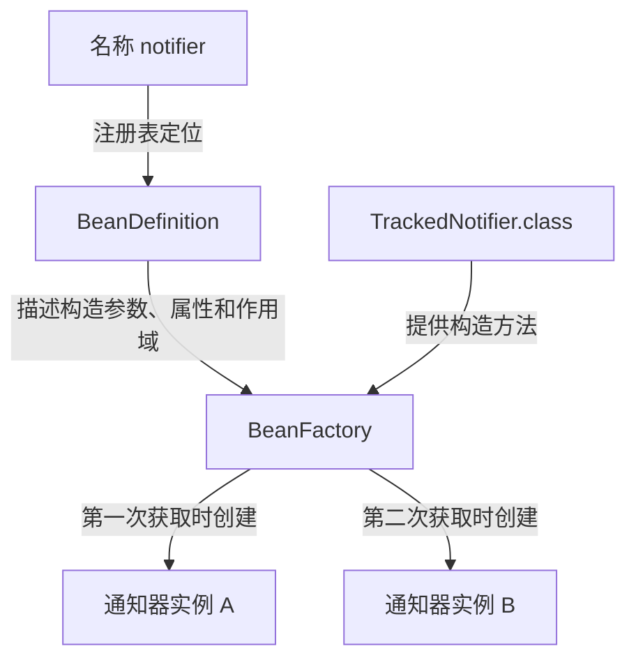

# 08-01-006 BeanDefinition 的基本模型：机制与边界参考

首次学习请先完成 [逐步实作正文](README.md)。本页保留完整样例、概念比较、源码入口与边界分析，用于跟写后的查阅。

[返回模块目录](../README.md) · [本课在大纲中的位置](../00-模块学习大纲.md#lesson-006) · [上一课：把第一个应用变成可维护的测试](../005-maintainable-container-tests/README.md)

前五课已经使用 Java 配置创建、获取和测试 Bean。现在进入第02篇，先回答一个更接近容器内部的问题：业务对象尚未产生时，Spring 凭什么知道要创建哪个类、传什么参数、使用什么作用域？

答案的一部分是 `BeanDefinition`。它保存创建和管理 Bean 所需的元数据。本课会直接构造一份定义，再观察它如何影响实例；随后回到 `@Bean`，读取框架生成的定义，把两条路径联系起来。

完成本课后，你应能区分类、定义、名称和实例，读懂主要元数据，并用实验解释注册、创建、初始化和销毁发生在什么时候。

<a id="section-1"></a>

## 1. 先分清四种不同的东西

| 概念 | 本课示例 | 它表示什么 |
| --- | --- | --- |
| Java 类及其 `Class` 对象 | `TrackedNotifier.class` | 类型本身，包含构造方法、字段和方法等信息 |
| Bean 定义 | 一个 `RootBeanDefinition` 对象 | 如何创建、配置和管理某个 Bean 的描述 |
| Bean 名称 | `notifier` | 注册表中定位这份定义及对应 Bean 的标识 |
| 业务 Bean 实例 | 容器创建的 `TrackedNotifier` 对象 | 实际持有状态、处理通知的对象 |

`new RootBeanDefinition(TrackedNotifier.class)` 会创建一个**定义对象**，并不会因此执行 `TrackedNotifier` 的构造器。讨论“对象还没创建”时，指的是业务实例，而不是说 JVM 中什么对象都没有产生。

Bean 名称也不是 Java 类自带的属性。注册方法把名称和定义关联起来；同一个类可以用于不同定义，一份定义又可以根据作用域产生一个或多个业务实例。官方对元数据及实例创建的介绍见 [Bean 概览](https://docs.spring.io/spring-framework/reference/core/beans/definition.html)。

对于本课的 prototype 场景，可以把关系表示为：



图描述的是这次 prototype 实验；单例场景下，重复获取会复用已创建的实例。

<a id="section-2"></a>

## 2. 这一课观察哪些业务状态

工程沿用 JDK 21、Spring Framework 7.0.9、Maven 聚合构建与 JUnit 5.13.4。源码放在 [lesson006 包](src/main/java/cn/ningbingjian/learnjava/ioc/lesson006)，不依赖历史课程的 JAR。

| 文件 | 职责 |
| --- | --- |
| [TrackedNotifier.java](src/main/java/cn/ningbingjian/learnjava/ioc/lesson006/TrackedNotifier.java) | 通过构造器接收渠道名与探针，通过 setter 接收前缀，支持初始化、通知和关闭 |
| [LifecycleProbe.java](src/main/java/cn/ningbingjian/learnjava/ioc/lesson006/LifecycleProbe.java) | 记录构造、属性配置、初始化、关闭事件与消息 |
| [DefinitionSamples.java](src/main/java/cn/ningbingjian/learnjava/ioc/lesson006/DefinitionSamples.java) | 提供通知器和订单服务的定义样本 |
| [OrderNotificationService.java](src/main/java/cn/ningbingjian/learnjava/ioc/lesson006/OrderNotificationService.java) | 依赖 `Notifier` 完成一次业务调用 |
| [JavaConfig.java](src/main/java/cn/ningbingjian/learnjava/ioc/lesson006/JavaConfig.java) | 提供 `@Bean` 配置，用于与手工定义对照 |
| [DemoApplication.java](src/main/java/cn/ningbingjian/learnjava/ioc/lesson006/DemoApplication.java) | 六个运行模式与观察输出 |

通知器构造时记录 `constructed`；`setPrefix` 记录 `configured:前缀`；`open` 记录 `opened`；`close` 记录 `closed`。`send` 要求已打开，并将消息存进探针。

这里没有真实连接，探针是单线程观察工具，没有静态全局计数。手工定义场景中，探针由入口创建，作为一个已存在的普通对象放进构造参数值中；它自身没有被注册成 Bean。后面的 `JavaConfig` 场景才把探针也声明为 Bean，两个场景的对象管理范围不同。

<a id="section-3"></a>

## 3. 用一份定义表达创建规则

[DefinitionSamples.notifierDefinition](src/main/java/cn/ningbingjian/learnjava/ioc/lesson006/DefinitionSamples.java) 返回如下定义：

```java
public static RootBeanDefinition notifierDefinition(LifecycleProbe probe) {
    var definition = new RootBeanDefinition(TrackedNotifier.class);
    definition.setScope(BeanDefinition.SCOPE_SINGLETON);
    definition.setLazyInit(false);
    definition.getConstructorArgumentValues().addIndexedArgumentValue(0, "email");
    definition.getConstructorArgumentValues().addIndexedArgumentValue(1, probe);
    definition.getPropertyValues().add("prefix", "[MAIL]");
    definition.setInitMethodName("open");
    definition.setDestroyMethodName("close");
    definition.setResourceDescription("lesson006:manual/notifier");
    return definition;
}
```

这里使用 `org.springframework.beans.factory.support.RootBeanDefinition`，它是 `BeanDefinition` 的一种实现。当前把它作为可直接配置的定义对象使用；定义继承、合并与内部缓存后续再展开。

逐项读这份配置：

| 设置 | 本例含义 | 要避免的混淆 |
| --- | --- | --- |
| `TrackedNotifier.class` | 通过这个类的构造器创建业务对象 | 不是已经创建的通知器实例 |
| `SCOPE_SINGLETON` | 对这个定义使用单例作用域 | 不是把整个 Java 类变成全局单例 |
| `lazyInit=false` | 不延迟本例单例的预实例化 | 不意味着注册方法立刻创建它 |
| 构造参数索引 `0` | 给构造器的 `channel` 传入字符串 `email` | 字符串不是自动按名查询 Bean 的指令 |
| 构造参数索引 `1` | 给构造器的 `probe` 传入已有观察对象 | 不是要求容器创建一个探针 Bean |
| 属性 `prefix` | 在本例中通过 `setPrefix` 配置 `[MAIL]` | 不是直接往私有字段随意写值 |
| 初始化方法 `open` | 属性配置后调用初始化方法 | 与 Java 构造器是不同阶段 |
| 销毁方法 `close` | 描述可使用的清理回调 | 是否由容器自动调用还与作用域有关 |
| 来源描述 | 为这份定义附加可读来源标记 | 这个字符串不是框架去加载的资源地址 |

构造参数索引从零开始。属性配置属于 JavaBeans 属性访问：本例存在可写的 `setPrefix(String)` 方法。后续类型转换、属性路径和更复杂值解析在相应课程展开。

本例显式填写 `singleton`，方便读取。其他定义的 `getScope()` 可能返回空字符串，表示未显式设置，并不意味着没有作用域；判断默认单例语义还可以看 `isSingleton()`。不要把本例的字符串输出当成所有定义的唯一表示。

<a id="section-4"></a>

## 4. 注册定义，然后只读取定义

仍使用已经熟悉的 `AnnotationConfigApplicationContext`。本次通过其继承的定义注册能力直接添加样本：

```java
context.registerBeanDefinition("notifier", DefinitionSamples.notifierDefinition(probe));
BeanDefinition definition = context.getBeanFactory().getBeanDefinition("notifier");
```

`registerBeanDefinition` 把名称与定义交给注册表；`getBeanDefinition` 读取定义。两者与 `getBean` 的用途不同。完整编程式注册 API 的选择放在第009课，本课只用这条入口观察模型。

从 `08-01-spring-core-ioc` 目录构建，然后运行：

```bash
mvn clean verify
mvn -q -pl 006-bean-definition-model exec:java -Dexec.args=metadata
```

```text
has-definition=true
has-singleton=false
bean-name=notifier
bean-class=cn.ningbingjian.learnjava.ioc.lesson006.TrackedNotifier
scope=singleton
lazy=false
constructor-arg-0=email
property-prefix=[MAIL]
init-method=open
destroy-method=close
origin=lesson006:manual/notifier
constructed=0
```

这个模式没有调用 `refresh()`。它用工厂 API 读取定义和已存在单例的状态，探针构造计数仍为零。

`has-definition=true` 与 `has-singleton=false` 可以同时成立：创建规则已经登记，当前还没有该名称对应的缓存单例。这里检查的是 `notifier`，不是说整个上下文没有基础设施定义。

`bean-name=notifier` 来自入口传入的注册名称；名称通过注册表与定义关联，不是从 `TrackedNotifier.class` 推导出来的。

读取元数据不等于可以提前通过上下文执行业务。第003课已经验证，尚未刷新的上下文不能直接按正常应用入口 `getBean`。本课也不会用底层工厂的其他能力绕过正常启动过程。

<a id="section-5"></a>

## 5. 非懒加载单例：创建发生在 refresh 中

```bash
mvn -q -pl 006-bean-definition-model exec:java -Dexec.args=eager
```

```text
registered.constructed=0
refreshed.constructed=1
refreshed.has-singleton=true
after-get.constructed=1
same-instance=true
messages=[[MAIL] email:hello]
events=[constructed, configured:[MAIL], opened, closed]
```

注册后构造次数为零，刷新后变成一。随后的两次 `getBean` 复用这个单例，没有增加构造次数。

事件顺序把定义中的三类信息接到了真实执行过程上：先根据构造参数创建对象，再应用 `prefix` 属性值，然后调用 `open`。退出资源作用域后才记录 `closed`。

`messages` 是列表的打印结果，外层方括号表示列表，里面的 `[MAIL]` 是配置前缀。消息中的 `email` 来自构造参数，前缀来自属性元数据，它们的来源可以分别追踪。

这些顺序由本例调用和测试共同验证，不需要从一大段框架日志推断。这里也没有引入自定义后处理器、代理或复杂初始化依赖，后续增加这些机制时再补全生命周期过程。

<a id="section-6"></a>

## 6. 懒加载单例：定义存在，实例可以晚些创建

```bash
mvn -q -pl 006-bean-definition-model exec:java -Dexec.args=lazy
```

```text
registered.constructed=0
refreshed.constructed=0
refreshed.has-singleton=false
after-get.constructed=1
same-instance=true
messages=[[MAIL] email:hello]
events=[constructed, configured:[MAIL], opened, closed]
```

与前一个场景相比，只在注册前把定义的 `lazyInit` 改为 `true`。没有其他对象提前需要这个通知器，所以刷新结束后它尚未产生；第一次获取时才执行构造、属性配置与初始化。

懒加载没有改变单例复用规则。第一次获取创建实例，第二次获取仍返回它。

测试还覆盖了另一种情况：懒加载定义注册并完成刷新后，从未被获取，直接关闭上下文。此时探针没有构造、初始化或销毁事件。容器没有必要为销毁一个从未创建的对象，先把它创建出来。

因此，定义数量、已创建单例数量和构造次数是三个不同指标。排查启动时不能仅凭注册表中有定义，就断言实例已初始化。

<a id="section-7"></a>

## 7. 懒加载不是“只能由用户第一次 getBean 触发”

订单服务定义使用一个 Bean 引用作为构造参数：

```java
public static RootBeanDefinition orderServiceDefinition() {
    var definition = new RootBeanDefinition(OrderNotificationService.class);
    definition.getConstructorArgumentValues()
            .addIndexedArgumentValue(0, new RuntimeBeanReference("notifier"));
    definition.setResourceDescription("lesson006:manual/orderService");
    return definition;
}
```

`RuntimeBeanReference("notifier")` 表达“解析这个名称对应的 Bean，并把结果用于该参数”。如果只是传入字符串 `"notifier"`，它表达的是字符串值，不会自动变成接口依赖。

这与第004课有一个区别：当时 `@Bean` 方法参数由框架按依赖信息解析；这里直接在定义中提供带名称的引用描述。业务类的构造器没有变化，两种配置都要最终传入一个符合 `Notifier` 类型的对象。

```bash
mvn -q -pl 006-bean-definition-model exec:java -Dexec.args=lazy-dependency
```

```text
registered.constructed=0
refreshed.constructed=1
refreshed.has-singleton=true
after-get.constructed=1
same-instance=true
messages=[[MAIL] email:order=O-001 accepted]
events=[constructed, configured:[MAIL], opened, closed]
```

这次通知器依旧配置懒加载，但新增的 `orderService` 是非懒加载单例。刷新时创建订单服务需要解析它的构造参数，从而请求通知器，所以通知器也在刷新期间创建。

懒加载控制的是预实例化安排，不能阻止其他 Bean 的必需依赖解析。本例没有使用延迟代理或提供者来间接持有依赖。相关规则见 [Spring 懒加载说明](https://docs.spring.io/spring-framework/reference/core/beans/dependencies/factory-lazy-init.html)。

<a id="section-8"></a>

## 8. 一份 prototype 定义可以创建多个实例

```bash
mvn -q -pl 006-bean-definition-model exec:java -Dexec.args=prototype
```

```text
refreshed.constructed=0
same-instance=false
after-get.constructed=2
has-definition=true
has-singleton=false
after-context-close.closed=0
after-caller-close.closed=2
```

本次只把通知器定义的作用域改成 `prototype`。刷新时没有预创建该对象，随后两次显式获取分别产生新实例，每个实例都完成属性配置与初始化。

即使已经产生两个实例，`containsSingleton("notifier")` 仍为 `false`。因此不能把“没有缓存单例”翻译成“从来没有创建过对象”。定义存在、实例产生、单例缓存命中需要分开观察。

本例还让容器先关闭，再让调用方关闭自己拿到的两个对象。因为 Spring 不负责 prototype 实例的完整销毁管理，容器关闭后计数仍为零。两个对象实现了 `AutoCloseable`，调用方使用 `try-with-resources` 持有它们，离开该作用域时计数变成二。作用域与销毁责任见 [Spring Bean 作用域说明](https://docs.spring.io/spring-framework/reference/core/beans/factory-scopes.html)。

入口外层仍保留上下文的资源作用域，以便发生意外异常时也有清理路径。演示中的显式 `context.close()` 用于观察关闭边界；外层再次关闭同一上下文不会重复销毁本例已管理的单例。

这说明定义中有 `destroyMethodName`，并不自动等于“所有作用域都由容器在结束时调用它”。完整作用域模型后续会单独学习，本课先用实例数和销毁计数验证差异。

<a id="section-9"></a>

## 9. 用一张表对照注册、创建与复用

下表只描述当前六个示例中涉及的普通通知器对象：

| 配置或状态 | 注册后已构造 | 刷新后已构造 | 两次获取后的构造次数 | 两次获取同一实例 |
| --- | --- | --- | --- | --- |
| 非懒加载单例 | 0 | 1 | 1 | 是 |
| 无其他依赖方的懒加载单例 | 0 | 0 | 1 | 是 |
| 被非懒加载服务依赖的懒加载单例 | 0 | 1 | 1 | 是 |
| prototype | 0 | 0 | 2 | 否 |

不要用“Spring 在启动时创建全部 Bean”概括这些行为，也不要用“Spring 在每次 getBean 时创建对象”概括它们。定义中的作用域、延迟标记和实际依赖关系一起影响结果。

`getBeanDefinition` 用来读取规则，`getBean` 用来获取符合规则的对象。前者拿到的不是业务对象，后者也不应被当成纯粹无副作用的查看操作。

<a id="section-10"></a>

## 10. 回到 @Bean：方法配置也会形成定义

[JavaConfig.java](src/main/java/cn/ningbingjian/learnjava/ioc/lesson006/JavaConfig.java) 中的工厂方法是：

```java
@Bean(name = "factoryNotifier", initMethod = "open", destroyMethod = "close")
public Notifier notifier(LifecycleProbe probe) {
    var notifier = new TrackedNotifier("email", probe);
    notifier.setPrefix("[JAVA]");
    return notifier;
}
```

本例配置类还声明了探针 Bean。使用第003、004课熟悉的注册和刷新方式，再读取 `factoryNotifier` 定义：

```bash
mvn -q -pl 006-bean-definition-model exec:java -Dexec.args=java-config
```

```text
before-refresh.has-factory-definition=false
after-refresh.has-factory-definition=true
bean-class=null
factory-bean=javaConfig
factory-method=notifier
has-resource=true
source-method=notifier
property-count=0
runtime-class=TrackedNotifier
messages=[[JAVA] email:hello]
```

注册配置类后、刷新前，`factoryNotifier` 定义尚不存在；刷新中处理配置类后，工厂方法对应的定义出现。这个时机与直接 `registerBeanDefinition` 后立刻存在样本定义不同，不能把所有注册入口合成一个动作。

最需要注意的是以下三个字段：

| 字段 | 本例结果 | 解释 |
| --- | --- | --- |
| `beanClassName` | `null` | 这份工厂方法定义没有直接指定通知器构造类名 |
| `factoryBeanName` | `javaConfig` | 通过该名称定位提供工厂方法的配置对象 |
| `factoryMethodName` | `notifier` | 调用配置对象的这个方法来提供 Bean |

这里的 `factoryBeanName` 是“提供实例工厂方法的 Bean 的名称”，不要因为名字相近就把它直接等同于 `FactoryBean<T>` 接口。本课没有编写该接口的实现。

`getBeanClassName()` 返回 `null` 并没有阻止通知器产生，因为定义提供的是另一种创建信息。方法声明返回 `Notifier`，运行时返回 `TrackedNotifier`，类型关系与上一课一致。

所以检查定义类型时不能只看一个类名字串。根据创建方式，还需要查看工厂方法、返回类型以及后续解析信息。不同注册入口和处理阶段的字段填充方式可能不同，本课的 `null` 是固定版本与当前配置下的观察结果。

<a id="section-11"></a>

## 11. 为什么 setter 调用了，property-count 却是零

手工定义中，我们写的是 `getPropertyValues().add("prefix", "[MAIL]")`，将属性值登记成元数据。Spring 在创建对象后读取这些属性配置并调用 setter。

`JavaConfig` 方法中写的是普通 Java 语句 `notifier.setPrefix("[JAVA]")`。它在工厂方法体执行时改变对象，框架没有把方法体里的每一条语句反向翻译成定义属性。

因此两种场景都能得到已配置前缀的对象，但配置记录位置不同：

| 对照项 | 手工定义 | 当前 @Bean 方法 |
| --- | --- | --- |
| 构造过程由谁直接表达 | 定义中的类与参数值 | 工厂方法体中的 Java 代码 |
| 前缀配置保存在哪里 | 定义的 `PropertyValues` | 方法体的一次 setter 调用 |
| 是否能在定义属性列表中看到前缀 | 能 | 本例不能 |
| 初始化回调 | 定义中的 `open` | 注解转为定义中的初始化信息 |

这也是为什么 `BeanDefinition` 不应被理解成业务类或任意 Java 代码的完整复制品。它保存容器管理需要的描述，普通方法体仍然保留在实际执行路径中。

<a id="section-12"></a>

## 12. 来源信息与运行前调整

手工样本设置了 `lesson006:manual/notifier` 作为来源描述。它是课程提供的诊断标记，不表示存在同名文件。第005课已经观察过异常中配置来源的价值，这里可以在定义阶段主动保留它。

`@Bean` 生成的定义则带有框架提供的资源描述与源元数据。本例 `getSource()` 可以按 `MethodMetadata` 读取到方法名 `notifier`。`source` 的具体类型由注册来源决定，不能对所有定义无条件强制转换为某种方法对象；示例使用 `instanceof` 后才读取。

注册表中的定义还可以在启动准备阶段调整。测试在注册后、`refresh` 前把 `prefix` 元数据改成 `[CHANGED]`，随后创建出的实例使用新前缀。

这验证的是**创建前的配置调整**。不要据此把运行中的 BeanDefinition 当作动态业务配置中心：对象可能已经初始化，容器也可能持有合并定义与类型缓存；修改定义并不意味着已注入的对象会自动更新。运行时并发注册与修改还涉及额外一致性问题，当前示例限定在单线程启动准备阶段。

<a id="section-13"></a>

## 13. 注册成功并不保证对象一定创建成功

测试在一份定义中增加不存在的 `missingProperty` 属性。定义能够登记进注册表，此时通知器构造次数仍为零。

执行 `refresh()` 后，容器构造了通知器，随后尝试应用属性配置，发现不存在对应的可写属性，抛出 `BeanCreationException`，最深层原因是 `NotWritablePropertyException`。本例初始化方法还没有执行。

按第005课的方法读取异常，就能得到：

| 线索 | 当前含义 |
| --- | --- |
| Bean 名 `notifier` | 哪个定义对应的对象创建失败 |
| 来源 `lesson006:manual/notifier` | 去哪里检查这份配置的构造代码 |
| 属性名 `missingProperty` | 哪个属性不能应用 |
| 构造次数为一、初始化次数为零 | 已构造，但未成功完成配置与初始化 |

不要为了让属性名通过就随意给业务类增加 setter。先判断是定义填写错误，还是业务对象本来就应该支持这项配置。

这个实验也没有涉及真实连接。实际资源如果在构造阶段就已分配，初始化失败时的资源归属与清理责任需要专门设计，不能假定一个最终未成功注册为可用单例的对象一定经过完整销毁流程。

<a id="section-14"></a>

## 14. 从定义注册走到源码中的创建入口

本课固定阅读 Spring **v7.0.9**。先认识三组职责，再沿当前对象实际经过的分支观察：

| 职责 | 入口 | 本课要核对什么 |
| --- | --- | --- |
| 描述规则 | `BeanDefinition`、`RootBeanDefinition` | 类、作用域、参数、属性、初始化及来源信息 |
| 登记和读取规则 | `BeanDefinitionRegistry`、`DefaultListableBeanFactory` | 名称与定义怎样进入注册表，读取返回什么 |
| 根据规则获取对象 | `AbstractBeanFactory`、`AbstractAutowireCapableBeanFactory` | 创建时如何取得需要的定义信息，怎样进入属性配置和初始化 |

源码入口：[BeanDefinition](https://github.com/spring-projects/spring-framework/blob/v7.0.9/spring-beans/src/main/java/org/springframework/beans/factory/config/BeanDefinition.java)、[RootBeanDefinition](https://github.com/spring-projects/spring-framework/blob/v7.0.9/spring-beans/src/main/java/org/springframework/beans/factory/support/RootBeanDefinition.java)、[BeanDefinitionRegistry](https://github.com/spring-projects/spring-framework/blob/v7.0.9/spring-beans/src/main/java/org/springframework/beans/factory/support/BeanDefinitionRegistry.java)。

使用本课模块类路径，以 `eager` 参数调试 `DemoApplication`：

1. 在 `DefinitionSamples.notifierDefinition` 返回前暂停，展开定义的构造参数与属性值。此时已有定义对象，探针还没有记录业务构造。
2. 在 `DefaultListableBeanFactory.registerBeanDefinition` 观察 `beanName` 为 `notifier` 的这次调用。这里处理名称与定义的登记；基础设施也会经过注册入口，不能把每一次命中都当成本课通知器。
3. 在自己代码的 `TrackedNotifier` 构造器暂停，查看调用栈，确认构造发生于这次 `refresh` 内。对照 `lazy` 模式，则应由后面的获取动作触发。
4. 在 `setPrefix` 暂停，观察参数 `[MAIL]`；向上查看 `populateBean`、`applyPropertyValues` 等属性应用路径。此时对象已经构造，尚未执行本例 `open`。
5. 在 `open` 暂停，确认前缀已应用，记录从定义值到业务状态的完整交接。

实现入口：[DefaultListableBeanFactory](https://github.com/spring-projects/spring-framework/blob/v7.0.9/spring-beans/src/main/java/org/springframework/beans/factory/support/DefaultListableBeanFactory.java)、[AbstractBeanFactory](https://github.com/spring-projects/spring-framework/blob/v7.0.9/spring-beans/src/main/java/org/springframework/beans/factory/support/AbstractBeanFactory.java)、[AbstractAutowireCapableBeanFactory](https://github.com/spring-projects/spring-framework/blob/v7.0.9/spring-beans/src/main/java/org/springframework/beans/factory/support/AbstractAutowireCapableBeanFactory.java)。

创建路径会涉及合并后的定义，例如 `getMergedLocalBeanDefinition`。本课读取的是注册信息，后续再解释为什么框架还需要合并与缓存；不要先假定每个执行阶段都使用你最初持有的同一个定义对象。

调试记录应写出本次 Bean 名、参数值、构造是否已经发生和初始化是否完成。只抄下经过的类名，还不能说明自己理解了定义如何驱动对象创建。

<a id="section-15"></a>

## 15. 测试覆盖与下一课

[BeanDefinitionModelTest.java](src/test/java/cn/ningbingjian/learnjava/ioc/lesson006/BeanDefinitionModelTest.java) 包含九个测试：

1. 注册与读取定义不构造本例业务对象。
2. 非懒加载单例先配置属性、后初始化，并在上下文退出时关闭。
3. 无其他依赖方的懒加载单例在首次获取时创建，之后复用。
4. 从未请求的懒加载单例没有初始化与销毁事件。
5. 非懒加载服务通过 Bean 引用提前创建懒加载依赖。
6. prototype 定义产生不同实例，清理由调用方完成。
7. 无效属性可以被登记，但对象创建时失败。
8. `@Bean` 定义描述工厂方法，不复制方法体中的 setter 语句。
9. 刷新前调整属性元数据会影响随后创建的对象。

只测试本课：

```bash
mvn -pl 006-bean-definition-model -am test
```

修改源码后编译并运行：

```bash
mvn -q -pl 006-bean-definition-model compile exec:java -Dexec.args=metadata
```

第001—006课聚合构建共 **53 个测试**。故意配置无效属性的测试会产生 Spring 警告，只要异常类型、状态与断言一致，测试就是通过。

可以自行完成三个单变量练习；仓库没有预先替你修改这些样本：

- 修改通知器定义的构造参数 `email`，解释消息中的渠道为何变化，而 Bean 名仍是 `notifier`。
- 让 `lazy-dependency` 场景的订单服务定义也延迟初始化，先在刷新后读取计数，再主动获取订单服务，比较通知器的创建时机。
- 把初始化方法名写错，比较它与无效属性场景的事件列表和最深层异常，判断失败发生在哪个阶段。

下一课：[08-01-007 组件扫描与注解注册](../007-component-scanning/README.md)。我们将沿本课的定义模型继续观察：类路径中的候选类如何被发现、命名并注册成定义，以及如何排查漏扫和重复扫描。
